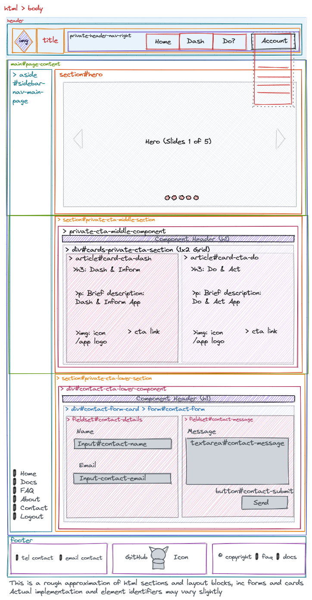

# dash-and-do-github

> Dash & Do GitHub Manager: A Dashboard (Reporting) and Do (Act or Automate) for GitHub Repositories

## 1.0 Introduction

---

[](https://standardjs.com)
[](https://wakatime.com/badge/user/2027c27d-0bab-4d7c-bfed-5d0b21285657/project/62c65141-830a-41c9-af92-98a9302fa984)

[](https://github.com/pylint-dev/pylint)
[](https://github.com/PyCQA/bandit)
[](https://github.com/gitleaks/gitleaks)

-   Share [WakaTime:](https://wakatime.com/@ipoetdev/projects/forvkqvyji)

---

### 1.1. [Goals](#goals)

#### 1.1.1 [App Goals](#app-goals)

-  To *manage a personal developer’s GitHub account* as a whole portfolio service, by connecting, and disconnecting, the
  web service with a developer GitHub account (maximum of 1 GitHub account).
- Use a *Report and Inform Dashboard*  for the developer on the state of their repositories under a single glance on a
  single pane of glass pattern via a Dashboard design. i.e. **The Dash, aka Dash & Inform.**
- Use a *To-do and Action task manager* for the developer in response to the state of their repositories so that they
  bulk edit on a single pane of glass pattern via a To Do and Tasker design. I.e. **The Do, aka Do & Act.**

#### 1.1.2 [Roadmap](#roadmap)

- Version 0.5: Dash & Do `Core`:
    -  MVC Component
    - Apps: Core,  Accounts:
    - Intent: Registration & Authentication
    - Pages:
                - Primary: Index (App), About (static), FAQ (static)
        - Service: Verify, Error
    - API Dependencies: GitHub Authentication, Authorisation APIs
    - Flows: Sign Up (1), Login, Reset (2), Verify (1,2), Contact, Return Sessions (?)
- Version 1.0: Dash and Do Reporting:
    - MVC target
    - Alias: Dash & Inform dashboard
    - Apps: Dash
    - Pages: Dash
    - Intent: Analysis, Reporting,
    - API Dependencies: GitHub Read & Listing APIs
    - Flows:
- Version: 1.5+: Dash and Do Manager: Do & Act task manager.
    -  MVC++ Future
    - Alias: Do & Act task manager
    - Apps: Do
    - Pages: Primary: Do
    - Intent: Bulk Edits, Central artefact repository (creating a central label database, a list of Social Preview images)
    - API Dependencies
    - Flows:

#### 1.1.2 [Project Goals](#project-goals)

-   #Client/Assessor #RFP To build a full-stack site based on business logic used to control a centrally owned dataset.
-   #Client/Assessor #RFP To set up an authentication mechanism and provide role-based access to the site's data or other
    activities based on the dataset.
-   #Solution To integrate GitHub with the Web App via GitHub social login and authentication tokens, with full lifecycle
    account management, via onboarding and offboarding of this social login.
-   #Solution To authorized and grant permissions to the web app, as a 3rd party` service|integration`, to one's own
    GitHub account or, maybe, a secondary one.
- #Solution To use GitHub API to perform the following:
    - Analyse and graphically report on Languages used.
    - Analyse and graphically report on File Types used.
    - Analyse and collated the labels used across all accounts.
    -   CRUD and manipulate Issue Labels in bulk, centrally and apply to `all|selected` repositories in bulk.
    -   Copy and Apply a central store of common file types to to `all|selected` repositories in bulk.
- #Project To use agile methodologies and tooling to deliver the #Solution to the #Client/Assessor: **<ins>The Code
    Institute</ins>.

***

### 1.2. [Live App](#live-app)

-   To see the live app: https://{{app-slug}}/herokuapp.com

- _APP/SERVICE NAME_: <ins>DASH &amp; DO GH MANAGER</ins>
-   _PROJECT REPO NAME_: `dash-and-do-for-github`
-   _REPOSITORY URL_: https://github.com/ipoetdev/dash-and-do-for-github

---

### 1.3. [App Visual](#app-visuals)


[`amiresponsive.co.uk/`](https://amiresponsive.co.uk/ 'Am I Responsive: amiresponsive.co. uk/') | `URI: AmIResponsive`

***
>
***

## 2.0 [Problem Statement](#problem-solve)

### 2.1. [Domain Driven Scenarios](#domain-scenarios)

A. **GitHub As a Portfolio?**

> > A question that occurs: _how can a developer treat and tailor his whole GitHub as a single sharable artefact in their portfolio and as a basis for his portfolio; and share to outside, or not GitHub account holders, and maximise the value of their GitHub account without given 3rd party access or having another crawl across their repositories in multiple pages and clicks._

B.

> > A question that occurs: _how can a potential employer inspect a prospective developer's GitHub at a glance, with meaningful analytics and high-level summary data?_

C.

> > A question that occurs: _how can, based on the prior question, can a developer keep track of the standard, conventional and best practices, on a per repository or bulk repository basis, with cross cutting concerns? Can he keep a in context to-do repository management list of common or standard tasks to maintain and manage his account over numerous repositories (i.e. greater than 5)._

D.

> > A question that occurs: _how can a developer apply GitHub features, which are manually created (e.g. labels, custom project fields), uniformly across more than two repositories and save time and effort on duplicative, repetitive and non-DRY iterative efforts. Such efforts have the challenge of lack of consistency and not being standard/best practice
> > driven._

E.

> > A question that occurs: _how can a developer apply GitHub best practices, like conventions and common files (examples of which are documented here), uniformly across more than two repositories and save time and effort on duplicative, repetitive and iterative file generation efforts. These generation efforts done once and repeated many times from a central source._

### 2.2. [Problem Concern](#problem-concern)

-   A GitHub account is a partially DRY system, and this is a dis-benefit to the author-developer.
-   A GitHub repository is a partially DRY system, and this is a dis-benefit to the author-developer.
-   A GitHub account is intentionally a fully adaptable and flexible platform; it is aimed to meet the widest number of use cases, target audiences via its universally open design.
    -   This lead to several user driven tasks to be manual, repetitive and not very good for DRY iteration.
    -   Such as:
        1. Label creation
        2. Issue Templates, in part
        3. GitHub Common Files (see below)
-   A GitHub account has no central store for certain artefacts that allow for one time editing and the more than one repository deployment, over a group of repositories. Such effort to duplicate and apply these programmatically.
-   A GitHub account does have selected analytics on a account or profile level basis. However, any proposed solution is looking to extend these analytics to drive an better "at a glance" overview.
-   There are no, as yet known by the author-developer, bulk editing features across two or more repositories. Such a feature would allow for improved user management experience in the application of conventions, standards and best practices.

### 2.3. [Developer Motivations](#motivations)

-   The author-developer needs a problem in search of a solution for an academic assignment, and as such is extending the
    GitHub concepts where they see dis-benefits or constraints in functionality.
-   The author-developer is sticking to what they know in a familiar domain, GitHub, and is seeking to deepen their
    knowledge and capacity in this platform. This they seek to showcase this in this project.

---
>
***

## 3.0 [Project](#project)

### 3.1. [Project Brief](#brief)

_To build a Full-Stack site based on business logic used to control a centrally owned dataset._

_Additionally, need to set up an authentication mechanism and provide role-based access to the site's data or other
activities based on the dataset._

---

### 3.2. [Project Methodology](#methodology)

-   [x] **ADR**: [ADR000X - Choose a project management and delivery methodology]()

- **Chosen**: Agile Methodology
- **Why**: Proscribed by the Client: The Code Institute as part of their software project portfolio development series
  in portfolio project 4: Full Stack Toolkit
- _Approach_:
    - Breaks project into iterative phases (i.e. sprints).
    - Emphasizes continuous adaption, adjustment to change, improvement, releases and customer feedback.
    - It's a cycle of flexible planning, execution and evaluation.
    - Is customised for a solo developer.
- _Is not_:
    - A collaborative approach for this solo project.

#### 3.2.1 Project Tooling: Zube.io

- The author/developer choose against using GitHub Projects for Agile Management, as it required a long of imposition of
  agile principles to be configured correctly.
- The author/developer choose for using a 3rd party Project Management Tool: [zube.io](https://zube.io/).
    - Has [Agile Components](https://zube.io/docs/components).
    - [GitHub Issues Can be Agile if You Do it Right | The Zube Blog](https://zube.io/blog/agile-project-management-workflow-for-github-issues/)
    - Installable via [GitHub Marketplace](https://github.com/marketplace/zube)
    - Is a stand-alone Agile Project Management tool.
    - Integrates and synchronises with GitHub Issues.
    - Organises and uses a Kanban Board and/or Sprint Boards
    - Defines Agile Epics and Scrum Style sprints
    - Is Free (up to 4 Users)
    - Utilises GitHub account or Gmail for social access login.
- The disadvantage (for assessment) is that:
    - Requires either a known Gmail account or a known GitHub to sign up.
    - By constraint, there is no common inbox for assessors to issue an onboarding email.
    - Assessors must be anonymous.
    - Requires a standalone temporary email account with a supplied username and password i.e. a proxy account.
    - This proxy guarantees the anonymity of the assessment process for the assessor.
    - Requires testing and testing before deadline.

Other benefits, that capitalises on prior effort by the author, was

- Provides a separate UI for managing the GitHub repository, issues, issues, milestones, templates that synchronises
  with GitHub.
- Can bulk edit issues and other features, with improved global effort and control.
- Integration of GitHub Issue Templates (see [3.3 Agile Artefacts](README.md#artefacts) below.)
- Definition of a End to End Workflow
    - 
- Has an inbuilt priorities over the setup of the GitHub Projects from blank slate
    - Blocker (P1), Critical (P2), Major (P3), Minor (P4), Trivial (P5)
- Uses a points system (Criteria: Merit: 1.5: User Stories, Points & Timeboxes prioritisations)
    - Uses a Fibonacci System (0,1,2,4,5,8,13). For purposes of this project, 13 is the max.
    - Employs a relative
      sizing, [see here: Practical Fibonacci: A Beginner's Guide to Relative Sizing | Scrum.org](https://www.scrum.org/resources/blog/practical-fibonacci-beginners-guide-relative-sizing)

#### 3.2.2 Relative Points

These relative points are a story point matrix of *Certainty/Risk* (y-axis) against *Effort/Complexity* (x axis), and
uses *Amount of Work* labels to categorise the scoring


- [ ] Resize 50%
- `Source`: [How to Begin Story Point Estimating](https://joshmartindev.com/2022/04/29/how-to-begin-story-point-estimating/)

- **Zero Points**: No Effort Required, or there is some effort required, but there is no business value delivered, so no
  Points are accumulated for doing the work.
    - <ins>0 pts: NO EFFORT: Very Easy (0) || No Uncertainty (0)</ins>
- **1-2 Points**: Developer feel they understand most requirements
  Developers consider it relatively easy, probably smallest items in the Sprint, and mostly likely completed in one day.
    - <ins>1 pts: EXTRA SMALL: Very Easy (1) || No Uncertainty (1)</ins>
    - <ins>2 pts: SMALL: Very Easy (1) || Little Uncertainty (2)</ins>
    - <ins>2 pts: SMALL: Medium (2) || No Uncertainty (1)</ins>
- **3 Points**: Developer(s) have done this a lot; knows what needs to be done.
  There may be a few extra steps. It's doubtful that extra research will be need.
    - <ins>3 pts: AVERAGE: Medium (3) || No Uncertainty (1)</ins>
    - <ins>3 pts: AVERAGE: Very Easy (1) || Little Uncertainty (3)</ins>
- **5 Points**: This is complex work, or Developers don't do this very often.
  Most Developers will need assistance from someone else. This is probably one of the largest items that can be
  completed within a Sprint.
    - <ins>5 pts: LARGE: Medium (5) || No Uncertainty (1)</ins>
    - <ins>5 pts: LARGE: Easy, Low Complexity (1) || Some Uncertainty (5)</ins>
- **8 Points**: Is going to take some time and research. Will take more than 1 developer to complete within two weeks.
  Plus: Developer need to make several assumptions that increase the risk. Likely to impact getting it Done.
    - <ins>8 pts: EXTRA LARGE: Hard Complexity (8) || No Uncertainty (1)</ins>
    - <ins>8 pts: LARGE: Easy, Low Complexity (1) || High Uncertainty (8)</ins>
- **13 Points**: Is a complex piece of work with lots of unknowns.
    - Requires multiple assumptions to size. It is too much to complete in one Sprint. Instead, split this into multiple
      Items that can be completed independently.
    - <ins>13 pts: WARNING: Hard Complexity (13) || Low Uncertainty (1)</ins>
    - <ins>13 WARNING: Easy, Low Complexity (1) || High Uncertainty (13)</ins>

***
>
---

### 3.3. [Agile Artefacts](#artefacts)

- Delivered by [GitHub Issue Template selector](https://github.com/iPoetDev/dash-and-do-github/issues/new/choose): and
  Zube.io.

- WORKFLOW: Flows are processes and step wise tutorials to complete a task/goal.
    - [00 DEFINE: Document | Readme](https://github.com/iPoetDev/dash-and-do-github/issues/new?assignees=&labels=&projects=&template=00-define--document---readme.md&title=):
        - Readme Development.
        - Document | Effort | Concept.
    - [00 REQUIRE: Product | Agile Specification](https://github.com/iPoetDev/dash-and-do-github/issues/new?assignees=iPoetDev&labels=Kind%3A+Define%2C+Kind%3A+Refine&projects=&template=00-require--product---agile-specification.md&title=DEFINE+%3A%3A+)
        - Product.
        - Agile Specification.
    - [00 FLOW: Workflow | Process | Checklist](https://github.com/iPoetDev/dash-and-do-github/issues/new?assignees=iPoetDev&labels=Deadline%3A+Oct+21%2C+Mentor%3A+1st+Review%3A+Aug+07%2C+Mentor%3A+2nd+Review%3A+%3A+Sep+04%2C+Mentor%3A+3rd+Review%3A+Oct+02%2C+Project+%3A+Inventory&projects=&template=00-flow--workflow---process---checklist.md&title=FLOW+%3A%3A+)
        - Best Practice.
        - Strategic or Tactical Workflow.
- SPRINTS: New Sprint for sprint planning/tracking.
    - [00 SPRINT: Plan & Report](https://github.com/iPoetDev/dash-and-do-github/issues/new?assignees=iPoetDev&labels=Kind%3A+Sprint%2C+Plan+%3A+Horizon%2C+Plan+%3A+Sprint%2C+Sprint+01+%3A+The+First+Config%2C+Sprint+02+%3A+Arch+n+Deploy%2C+W%2FE%3A+Aug+04%2C+W%2FE%3A+Aug+11%2C+W%2FE%3A+Aug+18%2C+W%2FE%3A+Aug+25%2C+W%2FE%3A+Jul+14%2C+W%2FE%3A+Jul+21%2C+W%2FE%3A+Jul+28%2C+W%2FE%3A+Oct+07%2C+W%2FE%3A+Oct+14%2C+W%2FE%3A+Oct+21%2C+W%2FE%3A+Sep+08%2C+W%2FE%3A+Sep+15%2C+W%2FE%3A+Sep+22%2C+W%2FE%3A+Sep+29&projects=&template=00-sprint--plan---report.md&title=%5BSPRINT%5D++%3A%3A+)
- ADR: _Any Decision Record_ <sup>[1]</sup>
    - [01: ADR Full](https://github.com/iPoetDev/dash-and-do-github/issues/new?assignees=iPoetDev&labels=&projects=&template=01--adr-full.md&title=ADR000%3F+%3A%3A+)
        - ADR Record - Full Tracing of Why & Motivations
        - Key Decisions and Derivations
    - [02 ADR-Y-Statement]().
        - ADR Short Form:
        - Problems Statements and Choices
- AGILE:
    - EPIC:
        - [03 EPIC: Feature | Infrastructure](https://github.com/iPoetDev/dash-and-do-github/issues/new?assignees=iPoetDev&labels=&projects=&template=03-epic--feature---infrastructure.md&title=EPIC000%3F+%3A%3A++)
            - A chapter of deliverable work.
            - Comprised of Features, User Stories & Enabler Tasks
    - FEATURE:
        - [04 FEAT: Feature | Component](https://github.com/iPoetDev/dash-and-do-github/issues/new?assignees=iPoetDev&labels=&projects=&template=04-feat--feature---component.md&title=FEAT+%3A%3A+)
            - RFC: An Epic's Feature.
            - An Epic's Component.
    - USER STORY & ACCEPTANCE:
        - [05 STORY: User Story | Use Case](https://github.com/iPoetDev/dash-and-do-github/issues/new?assignees=iPoetDev&labels=&projects=&template=05-story--user-story----use-case.md&title=STORY-000%3F+%3A%3A+)
            - An Epic's Task
            - Enabling Task linked to a Feature | Component
        - [06 ACCEPT: User Acceptance Criteria](https://github.com/iPoetDev/dash-and-do-github/issues/new?assignees=iPoetDev&labels=&projects=&template=06-accept--user-acceptance-criteria.md&title=UAC-000%3F+%3A%3A)
            - UAC: Scenario, Feature
            - Given ... When ... Then
    - QUALITY & TESTING:
        - [07 CHECK: Static Analysis](https://github.com/iPoetDev/dash-and-do-github/issues/new?assignees=iPoetDev&labels=&projects=&template=07-check--static-analysis.md&title=%5BCHECK+%7C+LINT%5D+%3A%3A+)
            - Pre-commit.
            - Lint Report
            - Static Analysis
            - W3C HTML & W3C CSS
        - [07 BUG: Exception | Issue | Usability | Function | Responsiveness](https://github.com/iPoetDev/dash-and-do-github/issues/new?assignees=iPoetDev&labels=&projects=&template=07-bug--exception---issue---usability---function---responsiveness.md&title=BUG+%3A%3A+++)
            - Code Exception |
            - Testing Issue |
            - UI/UX Concern |
            - UAT Issue
        - [08 TEST: Test Case | TDD](https://github.com/iPoetDev/P4Template/issues/new?assignees=iPoetDev&labels=&projects=&template=08-test--test-case---tdd--.md&title=%5BTEST%2FTDD%5D)
            - Test Case | TDD
        - [09 DONE: Definition of Done ](https://github.com/iPoetDev/dash-and-do-github/issues/new?assignees=iPoetDev&labels=&projects=&template=09-done--definition-of-done-.md&title=DONE%3A+)
            - Definition of Done
                - Effort and UAC for Final Release & Delivery
- CONFIG:
    - [10 CONFIG: Linting | Static Analysis | Common Setups)](https://github.com/iPoetDev/dash-and-do-github/issues/new?assignees=iPoetDev&labels=&projects=&template=09-config--linting---static-analysis---common-setups.md&title=CONFIG+%3A%3A+)
        - Tooling: Linting, Static Analysis
        - Common Setups: Public acceptable | Well Known Configuration
- PROJECT
    - [11 IMPEDE: Project Level Impediments](https://github.com/iPoetDev/dash-and-do-github/issues/new?assignees=iPoetDev&labels=Project%3A+Impediment&projects=&template=11-impede--project-level-impediments.md&title=IMPEDE%3A+Project+Blocker%3A+)
        - Project Impediment
        - Epic level blockers & issues.

### 3.4. [Readme]()

> PROJECT: Style | Approach | Key Deliverable

-   [x] Criteria: README
-   [ ] Completed? 🛫

- In English.
- Defined upfront, at start of the project cycle, a planning and delivery tool, not as an afterthought.
- Highly descriptive.
- Heading Hierarchy.
- Sequenced heading numbering.
- Headings linked and anchored.
- Highly detailed.
- Not Conventional, counter traditional and beyond the CI recommendation.
- Professional-grade project management and solution documentation.
- In the style of Readme Driven Development, this was written first before any code was committed.

***
> .
***

## 4.0 [Concept](#concept)

### 4.1. [Real World Domain](#domain)

- **<ins>Domain</ins>**: GitHub.com as a software development, source control and deployment collaboration platform.
- **<ins>Data Source</ins>**: GitHub API
- **<ins>Scenario</ins>**: A Personal Developer seeking to manage, report and make bulk changes/automations to their
  GitHub Account.

---
>
***

### 4.2 Target Audiences](#audiences)

- Focus is on:
    - **Core Audience**: Developers
        - Sub Cohort: Junior Developers
        - Sub Cohort: Open Source Developers
    - **Auxiliary Audience**: Software Managers
        - Sub-Cohort: Hiring Managers (Engineering Managers | Software Development Managers)
        - Sub-Cohort: Repo Managers in Open Source

---
>
***

### 4.3. [Web App Capabilities](#app-capabilities)

-   [ ] Criteria:
-   [ ] Review
-   [ ] Completed?

This app will serve users with the following:

- Ability, **_must have_**, to _`use|integrate`_ GitHub as a _`primary|secondary`_ _`social login`_ to
  _`access|connect`_ and _`authenticate`_ to the main web _`app|service`_. #Authentication #Access #Authorisation
  #Onboarding
- Ability, **_must have_**, to _`interact`_ with GitHub's API to access the public application and data interfaces of
  the GitHub platform, so to _`manipulate`_ and _`aggregate`_ one's own _`account|repository`_ data. #API #RestFul
- Ability, **_should have_**, to _`analyse`_ all repositories, _`public and|or private`_ and _`categorise`_ them, in
  bulk: #Repositories #DataAnalysis
    - The scope and frequency of languages uses. GitHub has this feature per repository.
    - The scope and frequency of file types uses (?). Subject to GitHub API definitions and terms of service.
    - The presence/absence of labels, number and completeness.
- Ability, **_should have_**, to _`report`_, using a _`client|server`_ rendered visual summarisation and collation
  approach, on the state of all repositories, and to _`provide`_ a an **_`"at a glance"`_** snapshot on the state of the
  account's repositories.
- Ability, **_could have_**, to perform bulk actions on specific GitHub features like:
    - **_Labels_** #FeatureCRUD
    - **_`Config.yml`_** #FileIO #API-I/O
    - **_Common Files_**, or Common Project files (see below). #FileI/O #API-I/O
- Ability, **could have**, to `store` a central file _`type|store`_, i.e. a pre-defined template, for a specific purpose
  and then `'Copy'` and `'Apply'` across those repository that do not have them. #FileIO #API-I/O
    - **Will not** have the ability to edit or change these files inside the web app.
        - This is out of scope as IDEs and the basic GitHub editing functionalities serve this role.
            - **Will not** have the ability to manipulate GitHub Account Settings or have the permission granted to
              them.
              #NotInScope
- Ability, **should have**, to _`remove`_ a GitHub _`social login`_ as a _`primary|secondary`_ source of _`access`_,
  _`authorisation`_ and or _`authentication`_, without affecting the primary login model and access control. #GitHub
  #Integration #OffBoarding

---
>
***

### 4.4. [Real User Frustration](#user-frustrations)

-   [ ] Criteria:
-   [ ] Completed? 🛫

This comes from the author/developer’s personal experience and fustrations. Given others’ comments in the Code
Institute, this may not be an isolated experience.

- Many of the GitHub platform activities are manual, iterative and repetitive.
    - This is am admirable quality of flexibility for maximum customisation and adaptability.
    - On the other hand, applying the same conventions, and standards consistently and uniformly across all the
      repositories is inconsistent, poor levelling of features, and user generated data etc.
- These user and usability frustration are a by-product of the user's personal experiences and user journey when using
  GitHub.com.

#### 4.4.1. Challenge: Creating Labels

> SOLUTION:

-   [ ] Criteria:

#### 4.4.2. Challenge: Common Files

> SOLUTION:

-   [ ] Criteria:

#### 4.4.3. Challenge: Cross Repository Actions & Activities

> SOLUTION:

-   [ ] Criteria:

---
>
***

### 4.5. Real World Solution & Idea

---
>
***

## 5.0 [Scope](#scope)

-   [ ] Criteria:
-   [x] Completed? 🛫

### 5.1. [Pre-conditions](#preconditions)

- The Project & Solution is delivered in an academic context.
- The Project & Solution is delivered inside a predefined timeboxed scope of 3 months.
- The Project is managed within the scope of an Agile project management methodology.
- The Deliverable is assessed and graded to a predefined evaluation schema and criteria.

---

### 5.2. [Assumptions](#assumptions)

- It is assumed the developer is a student with no prior experience, at a minimum.
- It is assumed that the student developer has attempted HTML & CSS Essentials, JavaScript Essentials and Python
  Essentials.
- It is assumed that the student developer comprehends and can produced a deliverable that is a minimally viable
  product.
- It is assumed that the student developer can deliver the deliverable within the allocated and predefined timeboxed
  scope of 3 months.

---

### 5.3. [Constraints](#contraints)

- An Agile Methodology is **mandated**, using Epic and User Stories as key artefacts.
- HTML, CSS and JavaScript are _recommended_ front-end technologies.
- Python and Django (web framework) are _recommended_ back-end technologies.
- Model View Controller is a _recommended_ architectural design pattern, a code factoring principle.
- That CRUD as a data manipulation pattern is **mandated**.
- A relational database is implicitly **mandated**, and is constrained by cost/affordability and access.
- A local version source control toolset, that uses Git, is **mandated**.
- A remote version source control platform, like GitHub.com, is **mandated**.
- A cloud based hosting platform is _recommended_, though the ultimate selection of which is up to developer.
- A Readme is a **mandated** and conventional documentation pattern that utilises the markdown format.
- The Readme **must be** written in English.
- The Readme can follow a _recommend_ structure.
- The web application **must have** a `lang` attribute set to English.

### 5.4 [Browsers Compatibility](#compatibilities)

- The application design for the web is further constrained by it's available global or local audience and their
  install-base of a browser.
- Browser compatibility is a essential aspect of a web application as the browser is the fundamental web application
  end-point
- Developer tools, like Autofixer (which tailwind recommends for applying browser vendor pre-fixes) aid in ensuring code
  compatibility and quality with Browsers
- So using these two services will aid the developer experience and ultimately the user experience

1. CanIUse
2. BrowserlIsr

#### 5.4.2 BrowserList

> SOLUTION: Developer Tool | Developer Experience | Audience Research | Browser Compatibility | Web App Performance

- Go
  to [Browserl.ist](https://browsersl.ist/#q=%3E0.3%25%2C+defaults%2C+supports+es6-module%2C+maintained+node+versions)
- View the query of the following in the above lint.
-
    - Added to` package.json` in root of project
- Audience coverage:97.3 %

```json
"browserslist":  [
    ">0.3%, defaults and supports es6-module",
    "maintained node versions"
],
```

---
> .
---

## 6.0 [Plan](#plan)

> PROJECT | SOLUTION: Definitions | Lists | Goals | Intent | Timeboxing

-   [ ] Criteria:
-   [ ] Completed? 🛫

> > - A README has visualisation/presentation constraints for presenting matrix like interconnected data, as below, due
      to its linear nature.
>> - Note that the author has created and split readme into 17 sections, given the projected length/complexity of the
     final
     readme.
> > - Refer to the following preconfigured GitHub tooling/features for a more interactive Agile tool.
> > - These planning artefacts are outline lists or checklists, not active deliverables.

### 6.1. [Planning Tool](#agile-tool)

> PROJECT: Tooling


**Choices**:

- _Chosen_: Zube.io AND **<ins>GitHub (Free)</ins>
  **: `GitHub Projects`, `GitHub Issues`, `GitHub Milestones`, `GitHub Labels`.
    - because it is free, integrated, localised, and GitHub is a recommended platform for VCS, though more
      effort/labour/investment to setup, configure from a blank start.
- _Alternatives_: ZenHub (Paid) | Jira (Heavyweight, Freemimum) | etc

---

### 6.2. [Sprints](#sprints)

> PROJECT: Iterations | Planning Horizon

-   [ ] Criteria:
-   [x] Completed? 🛫

- Kick off:
    - Start: \*<ins>10th July 2023</ins>
    - Early Due: _<ins>10th October 2023</ins>_ (12+ weeks)
    - Expected Due: _<ins>21th October 2023</ins>_ (14+ weeks)
- Planning Horizon is 2 weeks, max 3 weeks.
- There are **`12|13|14 nos of`** Sprints for Due.
- Each are **`5|7`** days in length _allowing for some down/off time_
- The frequency and length will be adjusted according to life, project and assignment timebox constraints.

---

### 6.3. [Workflows](#flows-activities)

- The following checklist as a progression of the development workflow overall.
-   [x] Pre-Project Template Flow 🛫 2023-06-26 ✅ 2023-07-04
-   [x] Project Management Flow.
    -   [x] Readme Drive Development Flow (This)
    -   [x] Flow - Sprint -> Milestone
    -   [x] GitHub into Agile Templates
        -   [ ] Templates | Artefacts
            -   [ ] **OO DEFINE**
            -   [ ] **OO REFINE
            -   [x] **00 FLOW: Workflow | Process**
            -   [x] **00 SPRINT: Plan & Report**
            -   [x] **01: ADR Full**
            -   [x] **02 ADR-Y-Statement**
            -   [x] **03 EPIC: Feature | Infrastructure**
            -   [x] **04 FEAT: Feature | Component**
            -   [x] **05 STORY: User Story | Use Case**
            -   [x] **06 ACCEPT: User Acceptance Criteria**
            -   [x] **07 BUG: Exception | Issue | Usability | Function | Responsiveness**
            -   [x] **08 TEST: Test Case | TDD |**
            -   [x] **09 CONFIG: Linting | Static Analysis | Common Setups**
            -   [x] **10 DONE: Definition of Done**
-   [ ] Deployment Flow (Heroku Flow)
-   [ ] Concept and Agile Planning: Epics and Story Development
-   [ ] Feature and User Acceptance Flow
-   [ ] Data Model Flow
-   [ ] Test Case Flow
-   [ ] Secure and Configure Flow
-   [ ] Plan, Control & Iterate Flow
-   [ ] Build & Test Flow
-   [x] Commit & Push Flow
-   [ ] Document & Results Flow
-   [ ] DoD & User Acceptance Flow
-   [ ] Submit Assignment Flow

---

### 6.4. [Decisions](#decisions)

> PROJECT: Requirements | Records | Choices | Logs | Deviations

-   [ ] Criteria:
-   [ ] Template:
-   [ ] Completed? 🛫

#### 6.4.1. [Pre-set Choices](#preset)

- These pre-set decision are imposed by the 'Client': The Code Institute to fulfil the Project Brief.

##### 6.4.1.1. PROJECT

- [ADR000X: Choose an Project Management Methodology: ***AGILE***]( ''ADR000X: Choose an Project Management Methodology:
  **AGILE**): \*\*ACCEPTED
- ADR000X: Choose a documentation convention, and file format, for the Project: **_README.md_** & **_MARKDOWN_**: \*
  \*ACCEPTED\*\*
- ADR000X: Choose a de-facto language for writing and documentation: **ENGLISH**: **ACCEPTED\*\***

##### 6.4.1.2. SOLUTION

- ADR000X: Choose the Front-end UI Technologies (Client Side Only): **_HTML, CSS, JS_**: _PROPOSED_
- ADR000X: Choose the Back-end Programming Language (Server-Side Only): **_PYTHON_**: **ACCEPTED**
- ADR000X: Choose the Back-end Web Application (rendering) Framework (Server Side Only): **_DJANGO_**: **ACCEPTED**
- ADR000X: Choose a software architectural (design & factoring) pattern: _MVC v MVT_ : _PROPOSED_
- ADR000X: Choose a data operation pattern, and UI conventions of user actions, for databases and data model
  manipulation: **C.R.U.D.** : **ACCEPTED**
- ADR000X: Choose a distributed version source control system and host: **_GIT & GITHUB_** : **ACCEPTED**
- ADR000X: Choose a cloud-based hosting platform: **HEROKU**: _PROPOSED_
- ADR000X: Choose a persistent data storage architecture for cloud hosted deployment model (i.e. a Managed Database
  Service): _ElephantSQL v Neon v etc_ : _PROPOSED_
- ADR000X: Choose a de-facto character-set's language for the web application, dependencies and
  technologies: \* \*<ins>`lang=en-gb`</ins>**: **ACCEPTED\*\*

#### 6.4.2. [Developer Selects](#developer-decision)

- These decisions are the developers own.

##### 6.4.2.1. PROJECT

- [ADR000X: Select an Agile Planning Tool: GitHub]( 'ADR000X: Select an Agile Planning Tool'): _ACCEPTED_

##### 6.4.2.2. SOLUTION

- ADR000X: Select data operation pattern, and UI conventions of user actions, for an internal API and network data
  exchange or manipulation (i.e. Web Application Network Architecture): Hypermedia v Data : _PROPOSED_
- ADR000X: Select data operation pattern, and UI conventions of user actions, for an external API and network data
  exchange or manipulation (i.e. External Service Network Architecture): Hypermedia v Data : _PROPOSED_
- ADR000X: Select technology that supported and implements a hypermedia centric Web Application Network Architecture,
  and extends HTML thus minimising JavaScript in a similar role: **_HTMX_** : **ACCEPTED**

---

### 6.5. [Epics](#epics)

-
    -

#### 6.5.1. Definition of Done

-   ***

### 6.6. [Features](#features)

-

#### 6.6.1. Definition of Done

-   ***

### 6.7. [User Stories](#stories)

-

#### 6.7.1. [Definition of Done](#done)

-   ***

### 6.8. [Test Methodologies](#test-methods)

- .

### 6.9. [Security Assurance](#security-assure)

-   ***

### 6.10. [User Acceptance](#acceptance)

-   [ ] Criteria:
-   [ ] Template:
-   [ ] Completed? 🛫

-

#### 6.10.1. [Definition of Done](#done)

-   [ ] Criteria:

---

### 6.11. [Verification](#verify)

- Given the academic context for project and solution delivery, meeting the academic requirements and assessment, as
  well as the developer's design assumptions and constraints, is the highest priority.
- An **_overall_** all **_definition of done_**, planned and tracked upfront, aids in this need.

#### 6.11.1. PROJECT: Definition of Done

-   [ ] **AGILE:** Has a agile tool that evidences the evolution of EPICs => _(Features)_ & User Stories => Tasks as
    evidence of using an Agile methodology in the project management.
-   [ ] **DOCUMENTATION:**
    -   [ ] **README:** Has a **_README.md_** that evidences the following:
        -   [ ] **PURPOSE**: Has a purpose and rational that are clearly defined, presented and documented in the
            README.
        -   [ ] **DECISIONS**: Has a fully justified ..(_decision record_) .. when there is a clear breach (deviations)
            of
            accepted design principles or usability experience principles, or via code organisation practices. The (
            software) architectural principles are a corollary to design principles, and are thus so included.
        -   [ ] **UX & DESIGN**: Has evidence of usability (experience & interaction) design work undertaken for this
            project via wireframes, mock-ups, diagrams as part of the design process.
        -   [ ] **DATA & DESIGN**: Has evidence of the data, the data-model and its design schema are fully documented.
        -   [ ] **UAC & UAT**: Has evidence of user acceptance criteria, and testing, that is clearly defined, and
            documented.
        -   [ ] **TEST PROCEDURES**: Has evidence of the testing procedures, and their results, that are fully
            documented.
        -   [ ] **SECURITY FEATURES**: Has evidenced of the security features, and optimal practices, being followed and
            documented.
        -   [ ] **ISSUE TRACKING**: All exceptions/code-issues (i.e. bugs), of found and fixed or no-fix state, are
            included with an (_summary_) explanation.
        -   [ ] **DEPLOYMENT**: Has evidence of the deployment of the final code being fully documented.
-   [ ] **VERSION CONTROL**: Has a **distributed version control system**, and a repository hosting service, that
    evidences using commit messages and a commit history that documented the evolution of the development process.
-   [ ] **CHECKLISTS**: `End-State`
    -   [ ] **README**: That all Section Headers' **_Completed?_** checkboxes are done: with a start date and a done
        date
    -   [ ] **AGILE ISSUES**: That, with best possible efforts, all agile related issues have been allocated to their
        best
        possible status and workflow phase, with a target state of Done and Deployed respectively.
    -   [ ] **CODE ISSUES**: That, with best possible efforts, all code related issues (i.e. bugs) are found, tracked,
        triaged and either fixed or classed a no-fix/wont fix.
    -   [ ] **TEST COVERAGE**: That all reasonable testing procedures are implemented with good enough level of
        coverage.
    -   [ ] **SECUIRTY CHECKS**: That all reasonable security features and practices are followed and validated.
    -   [ ] **FEATURE & USER**: That all feature and user acceptance criteria are tested and met.
    -   [ ] **DEPLOY & CONFIG**: That all appropriated and reasonable deployment and configuration checks are followed
        and
        complete before, during and after a deployment is made.
    -   [ ] **ACREDITATION**: That all 3rd party code references, guides, tutorials, including _direct AI generated
        code_
        m reuse are properly referenced and sources are validated, with best possible efforts.

---

#### 6.11.2. SOLUTION: Definition of Done

-   [ ] **USER CENTERED DESIGN:**
    -   [ ] **DESIGN THINKING**: Has evidence of design thinking principles and methodologies in the design of the web
        application solution.
    -   [ ] **WEB APP**:
        -   [ ] **BUSINESS LOGIC**: Has evidence of a real world domain base business logic with a state purpose and
            targeted user(s).
        -   [ ] **USER EXPERIENCE**:
            -   [ ] **FUNCTIONALITY**: Has evident intuitive comprehension of purpose, and activities.
            -   [ ] **ACCESSIBLE**: Is reasonably accessible and meeting common accessibility guidelines.
            -   [ ] **UX**: Follows optimal principles of user experience design.
            -   [ ] **INTERACTION**: Provides a sufficient set of user interactive experiences to provide a functional
                and
                user friendly experience in navigation, resource and information discovery and organisation.
            -   [ ] **RESPONSIVENESS**: Has evidence of screen based device responsiveness in the user interface layout
                and presentation across a range of device form factors.
            -   [ ] **FEEDBACK**: Has evident data or client side interactive feedback mechanisms to notify the user of
                web application responses, and changes to the data model by data processes.
        -   [ ] **DATA EXPERIENCES**: Has evident user actions for data driven experiences and manipulation that creates
            and add value to the purpose of the web app.
        -   [ ] **USER FEATURES**:
            -   [ ] **PROFILES**: Has evidence of user account creation (registration and profile creation.) and
                authentication (role based login and profile access)
-   [ ] **DEVELOPER DRIVEN DESIGN**:
    -   [ ] **SOFTWARE ARCHITECTURE**:
        -   [ ] **WEB**: Has evidence of a data-driven front end web application that is web based client-server
            architecture (i.e. the Full Stack).
        -   [ ] **DESIGN**: Has evidence of employing a MVC/T (mode-view-controller or template) software design pattern
            for developing the web application logic.
        -   [ ] **DATABASE**: Has evidence of employing a persistent data storage technology to build the web
            application
            upon.
        -   [ ] **DATA MODEL**: Has evidence of modelling and designing the data against the relevant real world problem
            domain.
        -   [ ] **CIA**: Has evidence of designing for confidentiality, integrity and availability by employing the
            security design principles of authorisation, authentication and access permission in using a role based
            access
            and profile design pattern.
    -   [ ] **CODE**:
        -   [ ] **STYLE**: Has evidence of following and conforming to language specific code styles and validators,
            demonstrating code integrity, consistency, organisation, and formatting.
        -   [ ] **SYNTAX**: Has evidence of demonstrable knowledge and proficiency of language specific structures and
            compound statements in the development of custom logic.
        -   [ ] **ORGANISATION**: Has evidence of suitable and compatible code, file and folder naming conventions, that
            improves, or mitigates for readability, system concerns, in a consistent and standard based approach.
        -   [ ] **RELIABILITY**: Has evidence of robust and 'clean' code that is free of exception and handles user and
            or
            system generated errors gracefully, with appropriate user feedback and failback options.
        -   [ ] **SECURITY**: Has evidence of securing and excluding non-authorised access to the code logic, of the web
            app by the design principles and practices of authorisation, authentication and access permissions.
        -   [ ] **SECRETS**: Has evidence of secure central storage and ease of control AND deployment, including API
            keys, access tokens and passwords, following best practices and platform terms of services.
    -   [ ] **DATA**:
        -   [ ] **STATE**: All changes to the state and integrity of the user's data should be notified and fed back to
            the user.
        -   [ ] **INPUT**: Has evidence of user generated external input is validates and check against data integrity
            rules before data process are allowed to commence.
        -   [ ] **OPERATIONS**: Has evidence of CRUD, as well as locate and display, data operations driving
            functionality
            and user interactions.
        -   [ ] **USER PROFILE**: Has evidence of employing a registration/login driven role based access and profile
            model for individual user accounts and design patterns.
        -   [ ] **SECURITY**: Has evidence of securing and excluding non-authorised access to the data model and code
            logic, of the web app by the design principles and practices of authorisation, authentication and access
            permissions.
        -   [ ] **CONFIGURATION**: Has evidence of secure central storage and ease of control AND deployment, including
            Database connection strings, access tokens and passwords, following best practices and platform terms of
            services.
    -   [ ] **TESTS**:
        -   [ ] **SCOPE**: Has evidence of assessment of an entire web application's functionality, usability,
            responsiveness and data management.
        -   [ ] **TYPES**: Has evidence of manual and/or automated tests in either Python or JavaScript.
        -   [ ] **PROCEDURES**: Has evidence of well-planned and documented test procedures to test the web application.
        -   [ ] **DESIGN**: Has evidence of test design for the web application and is fully documented.
        -   [ ] **EXECUTE**: Has evidence of testing, (i.e. implementation) of the web application and is fully
            documented.
        -   [ ] **RESULTS**: Has evidence of test results of these tests (procedures) on this web application and is
            fully
            documented.
        -   [ ] **EVALUATION**: Has evidence and evaluation of bugs found and their fixes, and those not fixed and these
            are fully documented.
    -   [ ] **DEPLOY**:
        -   [ ] **HOST**: Have evidence of an appropriately chosen and capable cloud based platform as a host for the
            web
            application and related contemporary technologies.
        -   [ ] **PROCEDURES**: Has evidence of a fully documented (see projects above) deployment workflow and
            procedures, accounting for end-to-end system configuration and integration up to to the web application's
            release into a live environment.
        -   [ ] **DEPENDENCIES**: Have evidence of main requirements and dependencies deploy to ensure the web
            application
            is build and deployed correctly to a live environment.
        -   [ ] **CONFIGURATION**: Have evidence of appropriate host/platform level and code level configuration for
            successful build and deployment of the web application to a live.
        -   [ ] **STATE**: Have evidence of no dead or comment out code or broken uniform resource indicators or
            locators (i.e. web links, module imports, environmental variables or database connections) in the final
            deployed code base.
        -   [ ] **SECURITY**: Has evidence of cloud host platform security as well as host code security, including no
            secrets in the remote repositories, secrets are obfuscated in the host platform environment variables, and
            specific files are listed in . *'*ignore\* files (e.g. `.gitinore`.).
        -   [ ] **DEBUG**: Has evidence of framework level configuration modes being disabled and asserts for production
            level live environments.
        -   [ ] **APP**: Has evidence that the deployed app has an appropriates URL to be access in the live environment
            without errors, application or HTTP faults.

---

#### 6.11.3. ASSESSMENT: Definition of Done

-   [ ] **CRITERIA**:
    -   [ ] **PASS**: To have met each the PASS assessment criteria and learning objectives.
    -   [ ] **MERIT**: To have met each of MERIT assessment criteria and learning objectives.
    -   [ ] **DISTINCION**: To have met each of DISTINCTION assessment criteria and learning objectives.
-   [ ] **CHECKLISTS**:
    -   [ ] **WIKI**: To have completed the assessment criteria checklist as published in the [project wiki's](#).

## 7.0 [Architecture](#architecture)

- .
- .

---

>

---

### 7.1 Method | Approach (C4 Model)

#### Why:

- C4 Model: [The C4 model for visualising software architecture]

```embed
title: "The C4 model for visualising software architecture"
image: "https://static.structurizr.com/workspace/36141/diagrams/SystemContext.png"
description:
"1. A set of hierarchical abstractions (software systems, containers, components, and code).
2. A set of hierarchical diagrams (system context, containers, components, and code).
3. Notation independent.
4. Tooling independent."
url: "https://c4model.com/"
```

- **Benefits**:
    - Is a map to the code
    - Notion & Tooling independent
    - Aids with communication
    - Abstraction first, constrained to 4 tiers of detail and number of diagram types.
- **Architecture Design Flow**:
    -   [x] [Level 1: System Context Diagram](https://c4model.com/#SystemContextDiagram) - on C4Model.com
    -   [x] [Level 2: Container Diagram](https://c4model.com/#ContainerDiagram) - on C4Model.com
    -   [x] [Level 3: Component Diagram](https://c4model.com/#ComponentDiagram) - on C4Model.com
    - ~~[Level 4: Code Diagram (`Optional`)](https://c4model.com/#CodeDiagram) - on C4Model.com [?]~~
-   [ ] Workflow:
-   [x] Design on Excalidraw in Obsidian under `Diagrams`
-   [x] Export / Copy to Readme (move images later)
-   [x] ## Add to Section below
                                    - [x] System Design
-
    -   [x] Container Design
-
    -   [ ] Component Design

> > > **`Optional`**: For this project, this level of detail is an optional nice to have if sufficient scope or time
> > > constraint before delivery.

---

### 7.2 System Design (C4 Model)

> SOLUTION: Big Picture | System Landscape | People Focus | Software Systems | System Scope | External Systems

-   [x] Completed
-   [ ] .

- [Level 1: System Context Diagram](https://c4model.com/#SystemContextDiagram) - on C4Model.com

#### 7.2.1 GitHub - Developer - Account System

> SOLUTION: External System

-   [x] Completed
-   [ ] .

- **`EXTERNAL SYSTEMS: A GitHub Real World Domain`**
- **System**: GitHub.com as a remote distributed code versioning system.
- **Users**: Developers, GitHub.com
- **Roles**: People, Organizations
- **External Dependencies**: GitHub User Account & Services, GitHub API
- **Data Source**: GitHub API
- **Scope**: Sits outside of the intended own software system
- **Diagram Audience**: Users, Assessors, Developers etc


`Diagram: EXTERNAL SYSTEMS: GitHub Real World Domain & Datasource`

---

#### 7.2.2 Dash and Do GitHub Managing System

> SOLUTION: Container (& Software Systems / Sub Containers) to External Containers

-   [x] Completed
-   [ ] .

_`Model Type: C4 System Context`_

\*\*`Diagram: SYSTEMS Context: Dash and Do GitHub Managing System

###### <ins>Overview</ins>

**1. Web Client**: GitHub <ins>Account</ins> - Developer - Own Web App & 2 Single Page Applications. [Sub System], e.g.
Django
**2. Web Server & API Client**: GitHub <ins>API</ins> - Developer - Own Web App (Django Web Server). [Sub System], e.g.
Django & Django Rest Framework
**3. Remote Backing Service**: Cloud Hosting Database-as-a-Service (App). [Sub System] e.g. Postgres SQL remote
relational database provider.
**4. Cloud Hosting**: Cloud Platform-as-a-Service (App) - Entire Dash & Do Software System [Container] e.g. Heroku
application service provider,
**5. GitHub External Systems**: e.g. GitHub Account, Repositories, API
**6. User/Person**: i.e. Developer

---

##### 7.2.2.1 The Web Client: GitHub <ins>Account</ins> - Developer - Own Web App [Dash & Do GH Manager]

> SOLUTION: CONTAINER: Software Sub-Container

-   [ ] Completed
-   [ ] .

- **`EXTERNAL SYSTEMS: A GitHub Real World Domain`**
- **System**: <ins>Web App Account Integration</ins>
- **Users**: Developers
- **Roles**: People
- \*\*External Dependencies: GitHub User Account & Services,
- **Data Source**: GitHub API, GitHub Account Auth. Tokens
- **Scope**: Sits outside of the intended own software system, but is an Application Interface with own Web App.
- **Features | Component**:
- **Diagram Audience**: Users


\*\*`Diagram: EXTERNAL-INTERNAL SYSTEMS: GitHub Account API to Own Web Account User Account

---

##### 7.2.2.2 The Web Server & API Client: GitHub <ins>API</ins> - Developer - Own Web App [Dash & Do GH Manager]

> SOLUTION: External System

-   [ ] Completed
-   [ ] .

- **`EXTERNAL SYSTEMS: A GitHub Real World Domain`**
- **System**: <ins>Web App Features Integration & Data Source</ins>
- **Users**: Developers
- **Roles**: People
- **External Dependencies**: GitHub API
- **Data Source**: GitHub API, GitHub Account Auth. Tokens
- **Scope**: Sits outside of the intended own software system, but is an Application Interface with own Web App
- **App Features | Component**:
- **Diagram Audience**: Users


\*\*`Diagram: EXTERNAL-INTERNAL SYSTEMS: GitHub Account API to Own Web Account User Account

##### 7.2.2.3 The Backing Service: Own Web App [Dash & Do GH Manager] - Cloud Hosting Database-as-a-Service (App)

> Managed Database Backing System
> SOLUTION: External System

-   [ ] Completed
-   [ ] .

- **`EXTERNAL SYSTEMS: Fully Managed Relational Database System, Cloud Hosted`**
- **System**: Cloud Hosting Managed Backing System
- **Users**: App Developers, Managed RBS Service Owner
- **Roles**: App Developer, RDB Account Owner, RBS Service Owner
- **External Dependencies**: External Managed Relational Database (Service, Host)
- **Data Source**: External Managed Relational Database (Service, Host)
- **Scope**: Sits outside the intended own software system, but is an Application Interface with own Web App
- **Features | Component**:
- **Diagram Audience**: Users


**`Diagram: EXTERNAL-INTERNAL SYSTEMS: Own Web App [Dash & Do GH Manager] - Cloud Hosting Database-as-a-Service (App)**

---

##### 7.2.2.4 The Cloud Hosting Platform: Own Web App [Dash & Do GH Manager] - Cloud Hosting Platform-as-a-Service (App)

> SOLUTION: External System

-   [ ] Completed
-   [ ] .

- **`EXTERNAL SYSTEMS: Cloud Hosting Platform-as-a-Service (App)`**
- **System**: Cloud Hosting Managed Backing System
- **Users**: App Developers, Managed RBS Service Owner
- **Roles**: App Developer, RDB Account Owner, RBS Service Owner
- **External Dependencies**: External Managed Relational Database (Service, Host)
- **Data Source**: External Managed Relational Database (Service, Host)
- **Scope**: Sits outside of the intended own software system, but is an Application Interface with own Web App
- **App Features | Component**:
- **Diagram Audience**: Users


**`Diagram: EXTERNAL-INTERNAL SYSTEMS: Own Web App [Dash & Do GH Manager] - Managed Database Backing System**

---

>

---

### 7.3 Container Design (C4 Model)

> SOLUTION: Application | Data Store | Sub System | Contained Design

-   [x] Completed
-   [ ] Reviewed?

- [Level 2: Container Diagram](https://c4model.com/#ContainerDiagram) - on C4Model.com
- `A container is essentially a context or boundary inside which some code is executed or some data is stored.`
- Each container 's:
    - a separately deployable/runnable thing or runtime environment.
    - typically (but not always) running in its own process space.
    - communication between containers typically takes the form of an inter-process communication (e.g. API, RPC etc).

##### 7.3.0.1 Definitions

- **Server-side web application**:
    - e.g. A Java EE web application running on Apache Tomcat, an ASP.NET MVC application running on Microsoft IIS, a
      Ruby on Rails application running on WEBrick, a Node.js application, etc.
- **Client-side web application**:
    - e.g. A JavaScript application running in a web browser using Angular, Backbone.JS, jQuery, etc.
- **Serverless function**:
    - A single serverless function (e.g. Amazon Lambda, Azure Function, etc).
- **Database**:
    - e.g. A schema or database in a relational database management system, document store, graph database, etc such as
      MySQL, Microsoft SQL Server, Oracle Database, MongoDB, Riak, Cassandra, Neo4j, etc.

_`Model Type: C4 Container`_

**`Diagram: CONTAINER - EXTNERAL CONTAINERS: The Dash & Do GitHub Managing System`**

**1. Front End Web Application/Client**: Web Application User Account & Profile[Sub System]
**1.1 Web SPA**: Web Application **Dash(board) Single Page Application** [Sub System]
**1.2. Web SPA**: Web Application **Do (& Act) Single Page Application** [Sub System]
**2. Web Server & API Application Middleware**: GitHub <ins>API</ins> - Developer - Own Web App (Django Web
Server). [Sub System]
**3. Database as a Service’s Managed Database**: Cloud Hosting Database-as-a-Service (App). [Sub System]
**4. Cloud Hosting Platform-as-a-Service (App)**: Entire Dash & Do Software System [Container]

---

#### 7.3.1 Web Application User Account & Profile

-   [ ] Completed
-   [ ] .

- **`CONTAINERS | SUB SYSTEMS: An Internal Web Application Domain`**
- **Containers**:
    - **Server-side web application**:
    - **Client-side web application**:
    - **Database**:
    - **Interface API**:
- **Architecture**: <ins>Web App Client - Server Architecture</ins>:
- **Part of**: _7.2.1 GitHub - Developer - Account System_
- **Actor**: Developer, GitHub API
- **External Dependencies**: Hub API, GitHub Access Token
- **Data Source**: GitHub API, GitHub Account Auth. Tokens
- **Scope**: Sits outside intended own software system, but is an Application Interface with own Web App.
- **App Features | Component**:
- **Diagram Audience**: Users


**`Diagram: EXTERNAL-INTERNAL SYSTEMS: Web Application User Account & Profile**

---

##### 7.3.1.1 Web Application Dash(board) Single Page Application

-   [ ] Completed
-   [ ] .

- **`CONTAINERS | SUB SYSTEMS: An Internal Web Application Domain`**
- **Containers**:
    - **Server-side web application**:
    - **Client-side web application**:
    - Middleware Web Framework: Django
    - **Database**:
        - ORM: Django ORM
    - **Interface API**:
- **Architecture**: <ins>Web App Client - Hypermedia API - Server Architecture</ins>:
- **Part of**: _7.2.1 GitHub - Developer - Account System_
- **Actor**: Developer, GitHub API
- **External Dependencies**s: GitHub API, GitHub Access Token.
- **Data Source**: GitHub API, GitHub Account Auth. Tokens
- **Scope**: Sits outside the intended own software system, but is an Application Interface with own Web App.
- **App Features | Component**:
- **Diagram Audience**: Users


**`Diagram: INTERNAL SYSTEMS: Web Application Dash(board) Single Page Application**

---

##### 7.3.1.2 Web Application Do(Repo tasks) Single Page Application

-   [ ] Completed
-   [ ] .

- **`CONTAINERS | SUB SYSTEMS: An Internal Web Application Domain`**
- **Containers**:
    - **Server-side web application**:
    - **Client-side web application**:
    - Middleware Web Framework: Django
    - **Database**: Postgres SQL
        - ORM: Django ORM
    - **Interface API**:
- **Architecture**: <ins>Web App Client - Hypermedia API - Server Architecture</ins>:
    - Style: Hypermedia Drive API
- **Part of**: _7.2.1 GitHub - Developer - Account System_
- **Actor**: Developer, GitHub API
- **External Dependencies**: GitHub API, GitHub Access Token.
- **Data Source**: GitHub API, GitHub Account Auth. Tokens
- **Scope**: Sits outside the intended own software system, but is an Application Interface with own Web App.
- **Features | Component**:
- **Diagram Audience**: Users


**`Diagram: INTERNAL SYSTEMS: Web Application Do(Repo tasks) Single Page Application**

---

#### 7.3.3 Web Server & API Application Middleware/Client

-   [ ] Completed
-   [ ] .

- **`CONTAINERS | SUB SYSTEMS: An Internal Web Application Domain`**
- **Containers**:
    - **Server-side web application**:
    - **Client-side web application**:
    - Middleware Web Framework: Django
    - **Database**: Postgres SQL
        - ORM: Django ORM
    - **Interface API**:
- **Architecture**: <ins>Web App Client - Hypermedia API - Server Architecture</ins>:
    - Style: Hypermedia Drive API
- **Part of**: _7.2.1 GitHub - Developer - Account System_
- **Actor**: Developer, GitHub API
- **External Dependencies**s: GitHub API, GitHub Access Token.
- **Data Source**: GitHub API, GitHub Account Auth. Tokens
- **Scope**: Sits outside of the intended own software system, but is an Application Interface with own Web App.
- **App Features | Component**:
- **Diagram Audience**: Users


**`Diagram: INTERNAL SYSTEMS: Web Application Do(Repo tasks) Single Page Application**

---

#### 7.3.4 Managed Relational Database

-   [ ] Completed
-   [ ] .

- **`CONTAINERS | SUB SYSTEMS: An Internal Web Application Domain`**
- **Containers**:
    - **Server-side web application**:
    - **Client-side web application**:
    - Middleware Web Framework: Django
    - **Database**: Postgres SQL
        - ORM: Django ORM
    - **Interface API**:
- **Architecture**: <ins>Web App Client - Hypermedia API - Server Architecture</ins>:
    - Style: Hypermedia Drive API
- **Part of**: _7.2.1 GitHub - Developer - Account System_
- **Actor**: Developer, GitHub API.
- **External Dependencies**s: GitHub API, GitHub Access Token.
- **Data Source**: GitHub API, GitHub Account Auth. Tokens
- **Scope**: Sits outside of the intended own software system, but is an Application Interface with own Web App.
- **App Features | Component**:
- **Diagram Audience**: Users


**`Diagram: INTERNAL SYSTEMS: Web Application Do(Repo tasks) Single Page Application**

---

#### 7.3.5 Platform as Host - Application Services

-   [ ] Completed
-   [ ] .

- **`CONTAINERS | SUB SYSTEMS: An Internal Web Application Domain`**
- **Containers**:
    - **Server-side web application**:
    - **Client-side web application**:
    - Middleware Web Framework: Django
    - **Database**: Postgres SQL
        - ORM: Django ORM
    - **Interface API**:
- **Architecture**: <ins>Web App Client - Hypermedia API - Server Architecture</ins>:
    - Style: Hypermedia Drive API
- **Part of**: _7.2.1 GitHub - Developer - Account System_
- **Actor**: Developer, GitHub API
- \*\*External Dependencies: GitHub API, GitHub Access Token
- **Data Source**: GitHub API, GitHub Account Auth. Tokens
- **Scope**: Sits outside of the intended own software system, but is an Application Interface with own Web App
- **Features | Component**:
- **Diagram Audience**: Users


**`Diagram: INTERNAL SYSTEMS: Web Application Do(Repo tasks) Single Page Application**

---

>

---

### 7.4 Component Design (C4 Model)

> SOLUTION | Exclude Django Framework Components | Include Custom Components

-   [ ] Completed
-   [ ] .

- [Level 3: Component Diagram](https://c4model.com/#ComponentDiagram) - on C4Model.com

##### 7.4.0.1 Definition

- a component is a grouping of related functionality encapsulated behind a well-defined interface.
- a component as a collection of implementation classes behind an interface.
- all components inside a container typically execute in the same process space.
- **components are not separately deployable units,** and are highly dependent.

---

#### 7.4.1

> SOLUTION:

-   [ ] Completed
-   [ ] .

**Scope**: Target Container:
**Primary elements**: Components within the `container` in scope.

- .
- .
  **Supporting elements**:
- Containers (within the software system in scope) plus
- People directly connected to the components.
- software systems directly connected to the components.
  **Diagram Audience**: Software architects and developers.

---

>

---

### 7.5 Code Diagram 🚫 (C4 Model)

> SOLUTION: Not Recommend | System Design to Simple | Level of Detail No Required.

-   [ ] Completed
-   [ ] .

- For this project this is not necessary,
- Too high maintenance and effort to create, update and manage
- Services like [AppMap | Runtime Code Analysis for Developers AppMap https://appmap.io](https://appmap.io/) and IDEs
  can generate this level of detail on demand, for long-lived documentation,
- Available on demand, automatically generated by keep detail to a minimum as details of implementation are subject to
  frequently change.

**Read more**

-       -   [Level 4: Code Diagram (`Optional`)](https://c4model.com/#CodeDiagram) - on C4Model.com [?]

---

>

---

## 8.0 [Design](#design)

> SOLUTION: #DESIGN #Front-end | UXD | Strategy | Scope | Structure | Skeleton | Surface

-   [ ] Criteria:
-   [ ] Completed? 🛫

### 5 Planes of User Experience Design

- **<ins>Strategy</ins>** is covered by the these chapters in further detail
    - [01 Introduction]()
    - [02 Problem]()
    - [04 Concept]()
- **<ins>Scope</ins>** is covered by the these chapters in further detail
    - [05 Scope]()
    - [06 Plan]()
- **<ins>Structure</ins>** is covered by the these chapters in further detail
    - [07 Architecture]()
    - [08 Design]() - here.
    - [13 Quality]()
- **<ins>Skeleton</ins>** is covered by the these chapters in further detail
    - [07 Architecture]()
    - [08 Design]() - here.
    - [09 Data]()
    - [12 Test]()
- **<ins>Surface</ins>** is covered by the these chapters in further detail
    - [08 Design]() - here.
    - [14 Acceptance]()

- Ch 12,13,14 are subject to change

***
>
***

### 8.1 Structure

> Information Architecture | Site Map

#### 8.1.1 Navigation & IA

> Site Page | Page Locations | Page Relationships | Page Access

There are two major journeys at this level of hierarchy:

- **Public Access for Guest Visitors and Unauthenticated Users** who may or may not be prospective new users (Left hand
  side of site map)
- **Private Access for Authorised Visitors and Authenticated Users** who are current users (right hand side of site map)

There are three tiers of pages or associated workflows

- **Primary Pages**
  Pages a user can navigate to my primary or secondary navigation `<a>` links
  There are 3 level of views/page access:
    - **Mixed**: Index (*App*) i.e.  (Mixed: Public and Private), or otherwise: **ALL** or **ALLViews**
    - **Public**: About (*Static*), FAQ (*Static*), Reset (*App*) via PublicViews
    - **Private**: Dash (*App*), Do (*App*), Account (*App*) via PrivateViews
- **Service Pages**
  Often are orphan pages, that are dead ends or are a one time or infrequently accessed due to certain conditions, like#
    - Error Pages (HTTP Errors: 404, 403, 500+)
    - Verification Pages: Verify (Status pages for Public flows)
    - Confirmation Pages: Confirm (Status pages for Private flows)
- **Workflows & Forms**
  These processes are a combination of user interaction, user data submission, and data backend or email processes. They
  typically use email templates and end up on a verification service page.
    - *Sign Up Form:* Accessible by public users only. Send an verification email to new site user.
    - *Log In Form*: User enters the Private Access and gains access to the private pages, alongside the public
      navigation & public pages.
    - *Log out Control:* User exits the Private Access and looses access to the private pages, and only retains the
      public navigation & public pages.
    - *Reset Password Form*: Infrequent workflow when users properly manage their access. However is available on
      signup & login forms as secondary navigation link. Send an email reset password link.
    - *Contact Form*: Accessible by all users, defaults to public. Send an email to site contact and copy to the sender.


#### 8.2 System & Interaction

[The 5 elements of UX design explained - UX Design Institute](https://www.uxdesigninstitute.com/blog/5-elements-of-ux-design/#:~:text=From%20bottom%20to%20top%20those,goals%20or%20completing%20different%20tasks.)

- how users will interact
- how the system will respond
- what will happen if errors are made

-  [ ] conceptual models that explain each part of the user interface
-  [ ] in a flow chart format
    - defines what users can do and
    - how the product will react to each potential choice the user makes.

***

##### 8.2.1 Public Page Flow

###### 8.2.1.1 Core App System Flow

- Front End Template Design
- Backend Code Flows.


***

#### 8.4 Single Page & AJAX Flow using HTMX

##### 8.4.1 HTMX

According to [`html.org`](https://htmx.org/):

> htmx gives you access
> to[AJAX](https://htmx.org/docs/#ajax),[CSS Transitions](https://htmx.org/docs/#css_transitions),[WebSockets](https://htmx.org/docs/#websockets)
> and[Server Sent Events](https://htmx.org/docs/#sse)directly in HTML,
> using[attributes](https://htmx.org/reference/#attributes), so you can
> build[modern user interfaces](https://htmx.org/examples/)with the[simplicity](https://en.wikipedia.org/wiki/HATEOAS)
> and[power](https://www.ics.uci.edu/~fielding/pubs/dissertation/rest_arch_style.htm)of hypertext

The site
has [several essays that expand and expound on the concepts and benefits of hypermedia driven applications](https://htmx.org/essays/),
and it was the decision of the author/developer to pursue this as a interaction design paradigm. From the
essay: [</> htmx ~ Hypermedia-Driven Applications](https://htmx.org/essays/hypermedia-driven-applications/)

- The**Hypermedia Driven Application (HDA)**architecture is a new/old approach to building web applications.
- HDA architectures extending the existing HTML infrastructure of the web, namely HTML, by adding custom attributes (
  using a lightweight Javascript library.)
- HTMX and Django are a match well made and met.
- *Benefits*:
    - It combines the simplicity & flexibility of traditional Multi-Page Applications (MPAs) with the better user
      experience of[Single-Page Applications](https://en.wikipedia.org/wiki/Single-page_application)(SPAs).
    - Uses_declarative, HTML-embedded syntax_rather than imperative scripting to achieve better front-end interactivity
    - Interacts with the server**in terms of hypermedia**(i.e. HTML), particularly in the context of Django and Django
      driven HTML templates.
    - Uses JavaScript to not use JavaScript and or JSON for client side processing, network requests and http response
      payloads.

##### 8.4.2 Downgrading JavaScript to Client Side Interaction

Another significate consequence what the establishing of a design and development principle for the project to

- Minimise all possible client-side JavaScript processing where possible
- To allow only certain kinds and types of JavaScript by exception.
- To use recommended and compatible lightweight JavaScript for this purpose, such as [AplineJS](https://alpinejs.dev/),
  as recommended by [</> htmx ~ ](https://htmx.org), so to stay aligned with the **htmx’s** HDA architecture, design and
  interaction paradigm.

##### 8.4.3 Hypermedia Drive Applications via  Single Page Architectures & HTML/HTMX

The following are AJAX driven single page architectures, using HTMX.

- **Index.html** for:
    - Sign Up Form
    - Login Form
    - Contact Form
- **Account.html** for:
    - User Profile Form
    - Link GitHub Form
    - User Settings form
- **Dash.html** for:
    - .
- **Do.html** for:
    - .

This means that:

- Where ever form or form like behaviours happen that initiated a HTTP Request and Response, the following happens and
  is a departure from the default html page behaviours:
    - The page does not completely reload on html5 form target value for a GET or POST action or a user interaction of
      another kind.
    - The HTMX library, via AJAX and Fetch, only reloads the designated HTML element, either by `id` attribute or by
      walking the DOM and using another target method like `OuterHTML`.
    - The page only reloads if the HTMX attribute enforces that or by user initated action like a page reload.
    - That status messages are displayed on the same page, either by a notification or by a status message in targeted /
      replaced block.
        - Status messages as confirmation, information, unsuccessful or error messages.

***
>
***

### 8.3 Skeleton


#### 8.3.1 Public Page Flow

##### 8.3.1.1 Wireframe: Index.html

1. **Public Page Wireframe**


2. **Public Page User Flow and Wireframe’s Page Sections**


#### 8.3.2 Mobile User Interactions

- For the purposes of this app, a mobile user is defined by the
    1. Breakpoints of the Tailwinds/CSS Media Query
        - UI elements are hidden and inert on small screens below 768px (below and not including Medium breakpoint  )
        - The benefit is that this is easily defined in development and tested, by ‘‘fooling’’ user.
        - The con is that this approach is not optimal for production level releases
            - Workarounds for this approach are
                - Mobile browsers have a view desktop version, which I think disables all media queries; and gives user
                  access via the desktop defaults.

- Mobile Users can
    - Browse the site using public navigation only.
        - Browse the Home page
        - Browse the FAQ page
        - Browse the About page
    - Contact the site via contact form and a message will be send to site owner and a copy to the sender
    - Sign Up to the Web App
    - Verify from a mobile
    - Can access public UI component

- Mobile Users can not
    - Can not browse the private navigation
    - See or navigate to the Login Form
    - Log in to the app
    - Can not access private UI components.

##### 8.3.2.1 Mobile User Public Page Flow


#### 8.3.3 Tablet & Desktop User Interactions (Tablet+ Users)

- For the purposes of this app, a tablet and or desktop user is defined by the
    1. Breakpoints of the Tailwinds/CSS Media Query
        - UI elements are show and available on medium and above sized screens; i.e. above 768px (above and including
          Tailwind’s Medium breakpoint)
        - The benefit is that this is easily defined in development and tested, by ‘‘fooling’’ user.
        - The con is that this approach is not optimal for production level releases
            - Workarounds for this approach are
                - Mobile browsers have a view desktop version, which I think disables all media queries; and gives user
                  access via the desktop defaults.

- Tablet+ Users can for public access
    - Browse the site using public navigation only.
        - Browse the Home page
        - Browse the FAQ page
        - Browse the About page
    - Contact the site via contact form and a message will be send to site owner and a copy to the sender
    - Sign Up to the Web App
    - Verify from a mobile
    - Can access public UI component

- Tablet+ Users can also for private access
    - Can browse the private navigation
    - Can access the Login Form
    - Can log in to the app
    - Can access private UI components.

##### 8.3.3.1 Tablet+ Users Public Page Flow


#### 8.3.4 Private Page Flow

##### 8.3.4.1 Wireframe: Index.html



***

>

***

## 9.0 [Data](#)

***

>

***

## 10.0 [Build](#build)

### 10.1. [Branching](#branches)

- **Style**: Trunk Based Development (i.e. long lived branches for dedicated intents).
- **Epic-**: _Development Trunks_: Limited to number of epics, push from local to remote/origin.
- **Main**: _Integration Trunk_, CI Pull Request target from EPIC based branches into Main branch. No push from local to
  origin/main. Protected branch. Review Gate.
- **Heroku-**: _Deployment Trunks_, CI Pull Request target from Main into Heroku-_ branches_.

#### 10.1.1. [Epic-Flow](#build-epic-flow)

1. Pull Request from `local/epic-*` (the local) to `origin/epic-*`(the remote) branch for \*\*MANUAL COMMIT & PUSH
2. Protect `origin/main` & `origin/heroku` branch from changes or having anything pushed
3. Merge from `epic-*` to `main` branch for each code review, CI actions, and code quality checks (inc, pre-commits)
4. From `raw/new code` -> `linted code` -> `manually tested` -> `locally` ...?
5. Use **Trunk based development** from the **`local/epic-*`** branch to **`origin/epic-*`** branch
    - Commit Style: Merge/Push to \*_``local/epic-_`` for development codebase.
    - Once the GitHub CI Apps (above) have passed all checks.
    - Tag|Label Code ready for **versioning/changelogging/pre-integration/commit**: Push to `origin/epic-*` on remote.

-   [ ] `ADD GIT FLOW DIAGRAM`

#### 10.1.2. Review-Flow

1. Pull Request from `epic-*` to `main` branch for **MANUAL INTEGRATION**
2. Protect `main` branch from changes or having anything pushed
3. Merge from `epic-*` to `main` branch for each code review, CI actions, and code quality checks (inc, AI Agent
   prompts)
4.
From `raw/new code` -> `linted code` -> `manually tested` -> `locally running` -> `PR#1` -> `Merge to Main` -> `GitHub CI `
5. Use **Trunk based development** from the **`epic-*`** branch to **`main`** branch
    - Commit Style: Merge/Push to **`epic-*`** for development codebase.
    - Once the GitHub CI Apps (above) have passed all checks.
    - Tag|Label Code ready for **integration**: Push to **`main`**

-   [ ] `ADD GIT FLOW DIAGRAM`

#### 10.1.3. Deploy-Flow

1. Pull Request from `main` to `heroku` branch for **AUTOMATED DEPLOYMENT**
2. Protect `heroku` branch from changes or having anything pushed
3. Merge from `main` to `heroku` branch for each release
4.
From `raw/new code` -> `linted code` -> `manually tested` -> `locally running` -> `PR#1` -> `Merge to Heroku` -> `Heroku Automated`
5. Use **Trunk based development** from the `main` branch to `heroku` branch
    - Commit Style: Push to `main` for development codebase.
    - Once the GitHub CI Apps (above) have passed all checks.
    - Tag Code ready for deployment: Push to `heroku`
    - Deployment is automated via Heroku's app deployment
    - By not having automated deployment on `main`, there is no failed deployment noise on `main` branch and in the
      logs.

-   [ ] `ADD GIT FLOW DIAGRAM`

---

### 10.2. Commit

> SOLUTION: Style | Template | Convention

-   [ ] _<small>Criteria: LO-05-PASS | LO-5.1-PASS | LO-5.1. 2-PASS | LO-5.1-MERIT</small>_
-   [ ] ADR:
-   [ ] Completed?

- ADR000X: Select a Commit Message Style: Conventional v Changelog Driven
    - Conventional Commits
        - Source: https://gist.github.com/qoomon/5dfcdf8eec66a051ecd85625518cfd13
    - Changelog Commits:
        - .
    - Custom Combined: An adapted merge of both styles.
        - See proposed below.

```git:
<agile><type>(<opt scope>): <subject>

Sprint: #  (Days:, End: )

Changelog: 2023-07-00 v0.0.0:00
<changelog body>
#add:
#mutate:
#remove:

Agilelog:
<agile tool items>
#epic
#story
#accept

---
<opt footer>
BREAKING CHANGE: <opt breaking>
Co-authored By: <name>
```

**_Example_**: **`Commit Template: Short`**

#### 10.2.1. Types

SOLUTION: Conventional Commits | [Source: Gist](https://gist.github.com/qoomon/5dfcdf8eec66a051ecd85625518cfd13) |
Pre-commit Hook

-   [ ] Criteria
-   [ ] **ADR**: [ADR000X - Implement a Manual Template or Enforce Pre-Commit Hook]
-   [ ] IDE Configured?
-   [ ] Completed?

- Relevant changes
    - `epic` Commits, that marks a start of a new epic branch <sup>authors own</sup>
    - `feat` Commits, that adds a new feature
    - `fix` Commits, that fixes a bug
- `refactor` Commits, that rewrite/restructure your code, however does not change any behaviour
    - `perf` Commits are special`refactor`commits, that improve performance
    - `revert` Commits that revert a refactor due to impact on behaviour.
- `style` Commits, that do not affect the meaning (white-space, formatting, missing semi-colons, etc)
- `test` Commits, that add missing tests or correcting existing tests
- `docs` Commits, that affect documentation only
- `build` Commits, that affect build components like build tool, ci pipeline, dependencies, project version, ...
    - `bump` Commits, that bump the software version/changelog by a **`major`.`minor`** version.
- `proj` Commits, that affect agile project management artefacts, likes epics, stories, acceptance
    - `agile/sprint`: Commits that mark a start of an agile activity, creation of a sprint
    - `agile/story` Commits that signal a user story activity, if appropriate
- `ops` Commits, that affect operational components like infrastructure, deployment, backup, recovery, ...
- `chore` Miscellaneous commits e.g. modifying`.gitignore`

-   [ ] `CONFIGURE IDE`
-   [ ] `PRACTICE IN IDE`
-   [ ] `DEVELOP A COMMIT FLOW`

#### 10.2.2 Scopes

-   [ ] **ADR**: [ADR000X - Implement a Manual Template or Enforce Pre-Commit Hook]()

- `PROJECT`
- `SOLUTION`

### 10.3. [Pre-commit](#pre-commit)

- .
- .

### 10.4. [Tooling](#tooling)

#### 10.4.1. [Languages](#)

| Language   | Environment     | Local | Remote | Extensions       | VERSION   | ADR | Use Case                                           |     |     |     |     |     |     |     |     |
|------------|-----------------|-------|--------|------------------|-----------|-----|----------------------------------------------------|-----|-----|-----|-----|-----|-----|-----|-----|
| HTML       | Browser, Client | Yes   | Yes    | Yes - HTMX[1]    | v5        |     | Front End UI, Hypermedia API[2]                    |     |     |     |     |     |     |     |     |
| CSS        | Browser, Client | Yes   | Yes    | No - `below`[3]  | v3        |     | Style, Responsiveness, Layout (Front End UI)       |     |     |     |     |     |     |     |     |
| JavaScript | Browser, Client | Yes   | Yes    | No - Native[4]   | v5        |     | Client Side Interaction (Front End UI)[5]          |     |     |     |     |     |     |     |     |
| Python     | OOP, Server     | Yes   | Yes    | Yes - `below`[6] | v 3.11.04 |     | Object Orientated Programming, Server Custom Logic |     |     |     |     |     |     |     |     |
| .          |                 |       |        |                  |           |     |                                                    |     |     |     |     |     |     |     |     |
| .          |                 |       |        |                  |           |     |                                                    |     |     |     |     |     |     |     |     |

-   [ ] <small>Checklist: [ ] Add Links in WebStorm [ ] Add superscript tag in Webstorm</small>

- 1: Use a JavaScript library to extend html attributed: [HTMX](https://htmx.org)
-
2: [Hypermedia API](https://htmx.org/essays/hypermedia-apis-vs-data-apis/) | [When to use Hypermedia](https://htmx.org/essays/when-to-use-hypermedia/)
- 3: ADR: Select a modern CSS utility framework
- 4: Constraint `JavaScript npm` 3rd party packages as dependencies in the Front End to non-network/server
  functionality.
- 5: ADR: Constraint JavaScript to Client-side only Interactivity
- 6: Django is a proscribed web application framework.

##### 10.4.1.1. Libraries, Framework, Component

| Library, Module, Package | Environment                      | Install Local | Install Remote | Language (Package Lang) | Version  | ADR | Use Cases                                            |
|--------------------------|----------------------------------|---------------|----------------|-------------------------|----------|-----|------------------------------------------------------|
| HTMX                     | Browser, CDN, Client             | ?             | ?              | HTML (JavaScript)       | v 1.9. 2 |     | Hypermedia API, Network Data (Front End DataOps)     |
| Boostrap, Tailwinds      | Browser, CDN, Client             | ?             | ?              | CSS                     | ?        | ?   | CSS Utility Framework, CSS Components (Front-End UI) |
| Django                   | Web Application, Server          | Yes           | Yes            | Python                  | v 4.2    |     | Web Applications, Templates, ORM & Database,         |
| Django REST              | Web API, JSON-RPC, Server        | Yes           | Yes            | Python                  | v 3.14.0 |     | For GitHub API processing                            |
| Postgres                 | Database, Managed Service, Cloud | No            | Yes            | Django, SQL (Python)    |          |     |                                                      |
| SQLite                   | Database, Local,                 | Yes           | No             | Django, SQL (Python)    |          |     | Included in the Django Data/ORM                      |
|                          |                                  |               |                |                         |          |     |                                                      |

-   [ ] <small>Checklist: [ ] Add Links in WebStorm [ ] Add superscript tag in Webstorm</small>

#### 10.4.2. [IDE & Extensions](#ide-editors)

| Editor, Plugins | Vendor    | Workflow | Key Plugins[7] | Version         | ADR | Editor Use                         | Plugin Use |
|-----------------|-----------|----------|----------------|-----------------|-----|------------------------------------|------------|
| PyCharm         | JetBrains | Python   | [8]            | 2023.01. 03 Pro |     | Test, Lint, Format, Django         |            |
| Webstorm        | JetBrains | Web      | [8]            | 2023.01. 03 Pro |     | HTML, JS, CSS, Test, Lint, Format, |            |
| DataGrip        | JetBrains | Data     | [8]            | 2023.01. 03 Pro |     | Database, Model                    |            |
| Aqua            | JetBrains | Browser  | [8],[9]        | 2023.01. 03 Pro |     | Browser Testing                    |            |
|                 |           |          |                |                 |     |                                    |            |
|                 |           |          |                |                 |     |                                    |            |
|                 |           |          |                |                 |     |                                    |            |
|                 |           |          |                |                 |     |                                    |            |
|                 |           |          |                |                 |     |                                    |            |
|                 |           |          |                |                 |     |                                    |            |
|                 |           |          |                |                 |     |                                    |            |
|                 |           |          |                |                 |     |                                    |            |

-   [ ] <small>Checklist: [ ] Add Links in WebStorm [ ] Add superscript tag in Webstorm</small>

- 8:
- 9.:

#### 10.4.3. [Code Linters](#linters)

> SOLUTION: Lint | Command Lines | Static Analysis | Code Formatting

-   [ ] Criteria
-   [ ] Completed? 🛫

- .
- .

#### 10.4.4. [AI Tools](#ai-tools)

> SOLUTION: Generation | Refactoring | Auto-completed | Test Generation

-   [ ] Criteria
-   [ ] Completed? 🛫

- .
- .

#### 10.4.5. [GitHub Apps/CI](#ci-apps)

> SOLUTION: CI/Pull Requests: Review: Refactoring | Format | Style | Checks

-   [ ] Criteria
-   [ ] Completed? 🛫

- .
- .

***

>

***

## 11.0 [Code](#code)

***

>

***

## 12.0 [Test](#testing)

***

>

***

## 13.0 [Quality](#quality)

***

>

***

## 14.0 [Features & User Acceptance](#)

***

>

| Epics                        | Features | Stories | Linked Apps | Notes |
| ---------------------------- | -------- | ------- | ----------- | ----- |
| #1: Readme Drive Development <br> Documentation First | –:       | Developer Story (DX)     | –:          |       |
| #2: Arch & Deploy <br> Decisions, Deployments, Platforms            |   –:       | Developer Story (DX)        |             |       |
| #3: Agile Design & BDD: <br> Epics, Features, UAC, Stories, Acceptance  | –:         | Developer Story (DX)          |             |       |

### 14.1.1 User Epics to Features

| Epic | Features                                                               | Linked Apps | Detail Readme | Release Plan  | Notes |     |
| ---- | ---------------------------------------------------------------------- | ----------- | ------------- | ------------- | ----- | --- |
| #4: PUBLIC Core Web App <br> & Public/Private Views/Access  | #98 [PUBLIC: `index.html` Page: All Users and Unauthenticated Users]() | Kore        |               | 0.5 MVC Minor |       |     |
| #4: PUBLIC Core Web App | #99 [PRIVATE: `index.html` Page: All Users and Authenticated Users]()  | Kore        |               | 0.5 MVC Minor |       |     |
| #4: PUBLIC Core Web App | #100                                                                   |             |               | 0.5 MVC Minor |       |     |
| #4: PUBLIC Core Web App | #101                                                                   |             |               | 0.5 MVC Minor |       |     |
| #5:  |                                                                        |             |               | 0.5 MVC Minor |       |     |
| #5:  |                                                                        |             |               | 0.5 MVC Minor |       |     |
| #5:  |                                                                        |             |               | 0.5 MVC Minor |       |     |
| #5:  |                                                                        |             |               | 0.5 MVC Minor |       |     |
| #7:  |                                                                        |             |               |               |       |     |
| #5:  |                                                                        |             |               |               |       |     |
| #6:  |                                                                        |             |               |               |       |     |
| #7:  |                                                                        |             |               |               |       |     |


### 14.3. [BDD & User Acceptance](#user-acceptance)

> SOLUTION: User Acceptance | User Story Testing

-   [ ] Criteria
-   [ ] Completed? 🛫

#### 14.3.1 BBD

- As per [BDD 101: Behavior-Driven Agile | Automation Panda.com](https://automationpanda.com/2017/02/01/bdd-101-bdd-and-agile/),

##### 14.3.1.1 Top Level Concepts
- BBD - Behaviour Driven Testing: optimally used for **black box testing**, higher order testing for the user experience. Learn more from: [BDD | Automation Panda](https://automationpanda.com/bdd/)
- Gherkin - domain specific language for behaviour scenarios. Learn more from: [BDD 101: The Gherkin Language | Automation Panda](https://automationpanda.com/2017/01/26/bdd-101-the-gherkin-language/)
- Feature: A user product or feature under test. [In BDD, What Should Be A Feature? | Automation Panda](https://automationpanda.com/2017/10/19/in-bdd-what-should-be-a-feature/)
- Scenario: Generally known as a test case, that concisely frames the behaviour under test.
- Give | When | Then: The structure specification keywords that uses natural language. not jargon, for all users to understand.
- Declarative: A focus on what behaviour is to happen, not how, and the expected outcome.
- Imperative: A focus on how behaviour operates, better suited to TDD and Unit testing.

##### 14.3.1.2  Further Reading:

- [BDD | Automation Panda](https://automationpanda.com/bdd/)

##### 14.3.1.3 AI Assisted Feature-Scenario Writing

- The author crafted and shaped the JetBrains AI Assistant (beta) to _conversationally_ (i.e. back and forth prompt-output-refactor) define the following Feature-Scenario as User Acceptance.
- This was a productivity, time manage and neural diversity win for the author.
- The author edited, groomed, aligned with his manually edited Epics, Features, and User Stories.
- These are then sorted, as per[ Python Behave](https://behave.readthedocs.io/en/latest/gherkin/#feature-testing-layout) and [Behave Django](https://behave-django.readthedocs.io/en/stable/usage.html), in side and along side the package/apps under test, in `.feature` files

##### 14.3.1.4 Manual over Automation

- The intent and use of this approach, for the stage and development maturity of the author, is on
    - Manual testing over automation
    - Discovery of the features and behaviours (successful and side effects) scenarios
    - The formation of the testing steps by breakdown and refinement of the  Scenario along the lines of user behaviour and expectations linked to each User Story

- Why not automate (yet):
    - Learning curve requirements, starting from a novice stand point.
    - Extra effort v time management prioritisation.
    - Additional complexity v risk prioritisation.
    - Additional requirements and supplementary tooling for test environment configuration, management and tear down.

All of these tests with have the `@manual` tag on each scenario, and maybe a few with `@automatable` just to indicate which could be automated in the future.

---

### 14.4 User Acceptance Testing

#### 14.4.1: Public & Private Site, Pages, Navigation

##### 14.4.1.1: Public Site, Pages & Navigation

-   [ ] **Requirement**: Public Site, Pages & Navigation
    - **Feature**: Public Site
        - **Gherkin File**: *PublicSite.feature*
    - **Scenarios / Stories**:
        - #82: ` Newly Visiting User's URL Story ` [#54 GitHub](https://github.com/iPoetDev/dash-and-do-github/issues/54)
        - #81:  ` New Visting User Story ` [#81 GitHub](https://github.com/iPoetDev/dash-and-do-github/issues/81)
        - #?? ` Show/Hide of Public Navigation and Page Components ` [#?? GitHub](https://github.com/iPoetDev/dash-and-do-github/issues/??)
        - #?? ` Site Branding ` [#?? GitHub](https://github.com/iPoetDev/dash-and-do-github/issues/??)
        - #?? ` Site Functionality/Responsiveness for Tablets+ screens ` [#?? GitHub](https://github.com/iPoetDev/dash-and-do-github/issues/??)
        - #?? ` Site Functionality/Responsiveness for Mobile only screen ` [#?? GitHub](https://github.com/iPoetDev/dash-and-do-github/issues/??)

###### 14.4.1.1.1 **UAC**: **`User Acceptance Test & Result`**
        -  #82: ` Newly Visiting User's URL Story ` [#54 GitHub](https://github.com/iPoetDev/dash-and-do-github/issues/54)
```
- The author has tested by <action> <resource/feature/story>
	- 1:
	- 2:
	- 3:
- As a user, the author can ...
- The result was ...
=============================================================
- UAT: `User Acceptance Test Statement`
  - .
- USER ACCEPTED: Yes ✅ | STOP 🚫
```
**UAC**: **`User Acceptance Criteria`**
        -  #81:  ` New Visting User Story ` [#81 GitHub](https://github.com/iPoetDev/dash-and-do-github/issues/81)
```
- The author has tested by <action> <resource/feature/story>
	- 1:
	- 2:
	- 3:
- As a user, the author can ...
- The result was ...
=============================================================
- UAT: `User Acceptance Test Statement`
  - .
- USER ACCEPTED: Yes ✅ | STOP 🚫
```
**UAC**: **`User Acceptance Criteria`**
        -  #?? ` Show/Hide of Public Navigation and Page Components ` [#?? GitHub](https://github.com/iPoetDev/dash-and-do-github/issues/??)
```
- The author has tested by <action> <resource/feature/story>
	- 1:
	- 2:
	- 3:
- As a user, the author can ...
- The result was ...
=============================================================
- UAT: `User Acceptance Test Statement`
  - .
- USER ACCEPTED: Yes ✅ | STOP 🚫
```
**UAC**: **`User Acceptance Criteria`**
        -  #?? ` Site Functionality/Responsiveness for Tablets+ screens ` [#?? GitHub](https://github.com/iPoetDev/dash-and-do-github/issues/??)
```
- The author has tested by <action> <resource/feature/story>
	- 1:
	- 2:
	- 3:
- As a user, the author can ...
- The result was ...
=============================================================
- UAT: `User Acceptance Test Statement`
  - .
- USER ACCEPTED: Yes ✅ | STOP 🚫
```
**UAC**: **`User Acceptance Criteria`**
        -  #?? ` Site Functionality/Responsiveness for Mobile only screen ` [#?? GitHub](https://github.com/iPoetDev/dash-and-do-github/issues/??)
```
- The author has tested by <action> <resource/feature/story>
	- 1:
	- 2:
	- 3:
- As a user, the author can ...
- The result was ...
=============================================================
- UAT: `User Acceptance Test Statement`
  - .
- USER ACCEPTED: Yes ✅ | STOP 🚫
```

---

##### 14.4.1.2 Private Site, Pages & Navigation

-   [ ] **Requirement**: Private Site, Pages & Navigation
    - **Feature**: Private Site
        - **User Acceptance Criteria**: *PrivateSite.feature*
    - **Scenarios / Stories**:
        - #82: ` Newly Visiting User's URL Story ` [#54 GitHub](https://github.com/iPoetDev/dash-and-do-github/issues/54)
        - #81:  ` New Visting User Story ` [#81 GitHub](https://github.com/iPoetDev/dash-and-do-github/issues/81)
        - #??:  ` Private Navigation and Private Components` [#?? GitHub](https://github.com/iPoetDev/dash-and-do-github/issues/??)
        - #??:  ` Site Functionality/Responsiveness for Tablet+ screens ` [#?? GitHub](https://github.com/iPoetDev/dash-and-do-github/issues/??)

###### 14.4.1.2.1 **UAC**: **`User Acceptance Test & Result`**`**
        -  #82: ` Newly Visiting User's URL Story ` [#54 GitHub](https://github.com/iPoetDev/dash-and-do-github/issues/54)
```
- The author has tested by <action> <resource/feature/story>
	- 1:
	- 2:
	- 3:
- As a user, the author can ...
- The result was ...
=============================================================
- UAT: `User Acceptance Test Statement`
  - .
- USER ACCEPTED: Yes ✅ | STOP 🚫
```
- UAC
    - #81: ` New Visting User Story ` [#54 GitHub](https://github.com/iPoetDev/dash-and-do-github/issues/54)
```
- The author has tested by <action> <resource/feature/story>
	- 1:
	- 2:
	- 3:
- As a user, the author can ...
- The result was ...
=============================================================
- UAT: `User Acceptance Test Statement`
  - .
- USER ACCEPTED: Yes ✅ | STOP 🚫
```
 - UAC
    - #??: ` Private Navigation/Components `  [#?? GitHub](https://github.com/iPoetDev/dash-and-do-github/issues/??)
```
- The author has tested by <action> <resource/feature/story>
	- 1:
	- 2:
	- 3:
- As a user, the author can ...
- The result was ...
=============================================================
- UAT: `User Acceptance Test Statement`
  - .
- USER ACCEPTED: Yes ✅ | STOP 🚫
```
 - UAC
    - #??: ` Site for Tablet+ Screens  `  [#?? GitHub](https://github.com/iPoetDev/dash-and-do-github/issues/??)
```
- The author has tested by <action> <resource/feature/story>
	- 1:
	- 2:
	- 3:
- As a user, the author can ...
- The result was ...
=============================================================
- UAT: `User Acceptance Test Statement`
  - .
- USER ACCEPTED: Yes ✅ | STOP 🚫
```

---

#### 14.4.2 Public Site: Account Creation, User Registration and Signup Form

-   [ ] **Requirement**: Public: Account Creation and User Registration
    - **Feature**: Account Creation
        - **User Acceptance Criteria**: *AccountCreate.feature*
    - **Scenarios / Stories**:
        - #54: ` New Registration User Story ` [#54 GitHub](https://github.com/iPoetDev/dash-and-do-github/issues/54)
        - #66:  ` Confirm Register User Story ` [#66 GitHub](https://github.com/iPoetDev/dash-and-do-github/issues/66)

##### 14.4.2.1. **UAC**: **`User Acceptance Test & Result`**`**
   -  #54: ` New Registration User's URL Story ` [#54 GitHub](https://github.com/iPoetDev/dash-and-do-github/issues/54)
```
- The author has tested by <action> <resource/feature/story>
	- 1:
	- 2:
	- 3:
- As a user, the author can ...
- The result was ...
=============================================================
- UAT: `User Acceptance Test Statement`
  - .
- USER ACCEPTED: Yes ✅ | STOP 🚫
```
- UAC
    - #66:  ` Confirm Register User Story ` [#66 GitHub](https://github.com/iPoetDev/dash-and-do-github/issues/66)
```
- The author has tested by <action> <resource/feature/story>
	- 1:
	- 2:
	- 3:
- As a user, the author can ...
- The result was ...
=============================================================
- UAT: `User Acceptance Test Statement`
  - .
- USER ACCEPTED: Yes ✅ | STOP 🚫
```

---
#### 14.4.3 Private Site: User Login, Account Authentication and Login Form

-   [ ] **Requirement**: Public: Account Creation and User Registration
    - **Feature**: UserLogin
        - **User Acceptance Criteria**: *UserLogin.feature*
    - **Scenarios / Stories**:
        - #67:  ` Successful Login Existing User Story ` [#67 GitHub](https://github.com/iPoetDev/dash-and-do-github/issues/67)
        - #68:  ` Unsuccessfully Login Existing User Story ` [#68 GitHub](https://github.com/iPoetDev/dash-and-do-github/issues/68)
        - #74:  ` User Session Forgets Story ` [#74 GitHub](https://github.com/iPoetDev/dash-and-do-github/issues/74)

##### 14.4.3.1 **UAC**: **`User Acceptance Test & Result`**

   - #67:  ` Successful Login Existing User Story ` [#67 GitHub](https://github.com/iPoetDev/dash-and-do-github/issues/67)
```
- The author has tested by <action> <resource/feature/story>
	- 1:
	- 2:
	- 3:
- As a user, the author can ...
- The result was ...
=============================================================
- UAT: `User Acceptance Test Statement`
  - .
- USER ACCEPTED: Yes ✅ | STOP 🚫
```

  - #68:  ` Unsuccessfully Login Existing User Story ` [#68 GitHub](https://github.com/iPoetDev/dash-and-do-github/issues/68)
```
- The author has tested by <action> <resource/feature/story>
	- 1:
	- 2:
	- 3:
- As a user, the author can ...
- The result was ...
=============================================================
- UAT: `User Acceptance Test Statement`
  - .
- USER ACCEPTED: Yes ✅ | STOP 🚫
```

   - #74:  ` User Session Forgets Story ` [#74 GitHub](https://github.com/iPoetDev/dash-and-do-github/issues/74)
```
- The author has tested by <action> <resource/feature/story>
	- 1:
	- 2:
	- 3:
- As a user, the author can ...
- The result was ...
=============================================================
- UAT: `User Acceptance Test Statement`
  - .
- USER ACCEPTED: Yes ✅ | STOP 🚫
```

***

#### 14.4.4 Private Site: User Profile & User Data Management

-   [ ] **Requirement**: Private: User Profile Access, User Settings and Account Removal
    - **Feature**: User Profile
        - **User Acceptance Criteria**: *UserProfile.feature*
    - **Scenarios / Stories**:
        - #75:  ` User Profile Access Story ` [#75 GitHub](https://github.com/iPoetDev/dash-and-do-github/issues/75)
        - #76:  ` User Profile Update Story ` [#76 GitHub](https://github.com/iPoetDev/dash-and-do-github/issues/76)
        - #77:  ` User Profile Deletion Story ` [#77 GitHub](https://github.com/iPoetDev/dash-and-do-github/issues/77)
        - #78:  ` User Account Removal Story ` [#78 GitHub](https://github.com/iPoetDev/dash-and-do-github/issues/78)

##### 14.4.4.1 **UAC**: **`User Acceptance Test & Result`**

   - #75:  ` User Profile Access Story ` [#75 GitHub](https://github.com/iPoetDev/dash-and-do-github/issues/75)
```
- The author has tested by <action> <resource/feature/story>
	- 1:
	- 2:
	- 3:
- As a user, the author can ...
- The result was ...
=============================================================
- UAT: `User Acceptance Test Statement`
  - .
- USER ACCEPTED: Yes ✅ | STOP 🚫
```

  - #76:  ` User Profile Update Story ` [#76 GitHub](https://github.com/iPoetDev/dash-and-do-github/issues/76)
```
- The author has tested by <action> <resource/feature/story>
	- 1:
	- 2:
	- 3:
- As a user, the author can ...
- The result was ...
=============================================================
- UAT: `User Acceptance Test Statement`
  - .
- USER ACCEPTED: Yes ✅ | STOP 🚫
```

   -  #77:  ` User Profile Deletion Story ` [#77 GitHub](https://github.com/iPoetDev/dash-and-do-github/issues/77)
```
- The author has tested by <action> <resource/feature/story>
	- 1:
	- 2:
	- 3:
- As a user, the author can ...
- The result was ...
=============================================================
- UAT: `User Acceptance Test Statement`
  - .
- USER ACCEPTED: Yes ✅ | STOP 🚫
```

   - #78:  ` User Account Removal Story ` [#78 GitHub](https://github.com/iPoetDev/dash-and-do-github/issues/78)
```
- The author has tested by <action> <resource/feature/story>
	- 1:
	- 2:
	- 3:
- As a user, the author can ...
- The result was ...
=============================================================
- UAT: `User Acceptance Test Statement`
  - .
- USER ACCEPTED: Yes ✅ | STOP 🚫
```

---

#### 14.4.5 Private Site: Staff User Access to Admin Site

-   [ ] **Requirement**: Private: Manage the Site, Be a Staff User and Access Admin Site
    - **Feature**: Administration Site with Staff User
        - **User Acceptance Criteria**: *AdminSite.feature*
    - **Scenarios / Stories**:
        - #79:  ` Admin User Profile Access Story ` [#79 GitHub](https://github.com/iPoetDev/dash-and-do-github/issues/79)
        - #80:  ` Admin User Profile Update Story ` [#80 GitHub](https://github.com/iPoetDev/dash-and-do-github/issues/80)

##### 14.4.5.1 **UAC**: **`User Acceptance Test & Result`**

   - #79:  ` Admin User Profile Access Story ` [#79 GitHub](https://github.com/iPoetDev/dash-and-do-github/issues/79)
```
- The author has tested by <action> <resource/feature/story>
	- 1:
	- 2:
	- 3:
- As a user, the author can ...
- The result was ...
=============================================================
- UAT: `User Acceptance Test Statement`
  - .
- USER ACCEPTED: Yes ✅ | STOP 🚫
```

   - #80:  ` Admin User Profile Update Story ` [#80 GitHub](https://github.com/iPoetDev/dash-and-do-github/issues/80)
```
- The author has tested by <action> <resource/feature/story>
	- 1:
	- 2:
	- 3:
- As a user, the author can ...
- The result was ...
=============================================================
- UAT: `User Acceptance Test Statement`
  - .
- USER ACCEPTED: Yes ✅ | STOP 🚫
```

---

#### 14.4.6 Messaging Site: Contact the Site Owner and Contact Form

-   [ ] **Requirement**: All/Anonymous: Contact the Site Owner, Send Copy and Contact Form
    - **Feature**: Messaging the Site
        - **User Acceptance Criteria**: *MessageSite.feature*
    - **Scenarios / Stories**:
        - #126:  ` Contact Site: User Story ` [#126 GitHub](https://github.com/iPoetDev/dash-and-do-github/issues/126)
        - #127:  ` Contact Email: User Story ` [#127 GitHub](https://github.com/iPoetDev/dash-and-do-github/issues/127)

##### 14.4.6.1 **UAC**: **`User Acceptance Test & Result`**

   - #126:  ` Contact Site: User Story ` [#126 GitHub](https://github.com/iPoetDev/dash-and-do-github/issues/126)
```
- The author has tested by <action> <resource/feature/story>
	- 1:
	- 2:
	- 3:
- As a user, the author can ...
- The result was ...
=============================================================
- UAT: `User Acceptance Test Statement`
  - .
- USER ACCEPTED: Yes ✅ | STOP 🚫
```

   - #127:  ` Contact Email: User Story ` [#127 GitHub](https://github.com/iPoetDev/dash-and-do-github/issues/127)
```
- The author has tested by <action> <resource/feature/story>
	- 1:
	- 2:
	- 3:
- As a user, the author can ...
- The result was ...
=============================================================
- UAT: `User Acceptance Test Statement`
  - .
- USER ACCEPTED: Yes ✅ | STOP 🚫
```

---

#### 14.4.7 Public: Password Management: Reset, Verification and Change.

-   [ ] **Requirement**: Password Management
    - **Feature**: PasswordManagement
        - **User Acceptance Criteria**: *PasswordManage.feature*
    - **Scenarios / Stories**:
        - #69:  ` Forgets Password User Story ` [#69 GitHub](https://github.com/iPoetDev/dash-and-do-github/issues/69)
        - #70:  ` Verify Reset User Story ` [#70 GitHub](https://github.com/iPoetDev/dash-and-do-github/issues/70)

##### 14.4.7.1 **UAC**: **`User Acceptance Test & Result`**

   - #69:  ` Forgets Password User Story ` [#69 GitHub](https://github.com/iPoetDev/dash-and-do-github/issues/69)
```
- The author has tested by <action> <resource/feature/story>
	- 1:
	- 2:
	- 3:
- As a user, the author can ...
- The result was ...
=============================================================
- UAT: `User Acceptance Test Statement`
  - .
- USER ACCEPTED: Yes ✅ | STOP 🚫
```

   - #70:  ` Verify Reset User Story ` [#70 GitHub](https://github.com/iPoetDev/dash-and-do-github/issues/70)
```
- The author has tested by <action> <resource/feature/story>
	- 1:
	- 2:
	- 3:
- As a user, the author can ...
- The result was ...
=============================================================
- UAT: `User Acceptance Test Statement`
  - .
- USER ACCEPTED: Yes ✅ | STOP 🚫
```

---

#### 14.4.8 Site Email Services

-   [ ] **Requirement**: Site Email for Messaging, Account Creation, and Password Management
    - **Feature**: EmailServices
        - **User Acceptance Criteria**: *EmailServices.feature*
    - **Scenarios / Stories**:
        - #??:  ` ??: User Story ` [#?? GitHub](https://github.com/iPoetDev/dash-and-do-github/issues/??)
        - #??:  ` ??: User Story ` [#?? GitHub](https://github.com/iPoetDev/dash-and-do-github/issues/??)
        - #??:  ` ??: User Story ` [#?? GitHub](https://github.com/iPoetDev/dash-and-do-github/issues/??)

##### 14.4.8.1 **UAC**: **`User Acceptance Test & Result`**


```
- The author has tested by <action> <resource/feature/story>
	- 1:
	- 2:
	- 3:
- As a user, the author can ...
- The result was ...
=============================================================
- UAT: `User Acceptance Test Statement`
  - .
- USER ACCEPTED: Yes ✅ | STOP 🚫
```


```
- The author has tested by <action> <resource/feature/story>
	- 1:
	- 2:
	- 3:
- As a user, the author can ...
- The result was ...
=============================================================
- UAT: `User Acceptance Test Statement`
  - .
- USER ACCEPTED: Yes ✅ | STOP 🚫
```

---

#### 14.4.9 User Session Management

-   [ ] **Requirement**: Site Email for Messaging, Account Creation, and Password Management
    - **Feature**: UserSessions
        - **User Acceptance Criteria**: *UserSessions.feature*
    - **Scenarios / Stories**:
        - #71:  ` Set + Persist Session: User Story ` [#71 GitHub](https://github.com/iPoetDev/dash-and-do-github/issues/71)
        - #73:  ` User Session Authorised: User Story ` [#73 GitHub](https://github.com/iPoetDev/dash-and-do-github/issues/73)

##### 14.4.8.1 **UAC**: **`User Acceptance Test & Result`**

   - #71:  ` Set + Persist Session: User Story ` [#?? GitHub](https://github.com/iPoetDev/dash-and-do-github/issues/71)
```
- The author has tested by <action> <resource/feature/story>
	- 1:
	- 2:
	- 3:
- As a user, the author can ...
- The result was ...
=============================================================
- UAT: `User Acceptance Test Statement`
  - .
- USER ACCEPTED: Yes ✅ | STOP 🚫
```

   - #73:  ` User Session Authorised: User Story ` [#73 GitHub](https://github.com/iPoetDev/dash-and-do-github/issues/73)
```
- The author has tested by <action> <resource/feature/story>
	- 1:
	- 2:
	- 3:
- As a user, the author can ...
- The result was ...
=============================================================
- UAT: `User Acceptance Test Statement`
  - .
- USER ACCEPTED: Yes ✅ | STOP 🚫
```

---

#### 14.4.10 User Permission Management

-   [ ] **Requirement**: Site Email for Messaging, Account Creation, and Password Management
    - **Feature**: EmailServices
        - **User Acceptance Criteria**: *EmailServices.feature*
    - **Scenarios / Stories**:
        - #84:  ` Unauthenticated User Login Story ` [#84 GitHub](https://github.com/iPoetDev/dash-and-do-github/issues/84)
        - #85:  ` Unauthorised/Access User Login Story ` [#85 GitHub](https://github.com/iPoetDev/dash-and-do-github/issues/85)

##### 14.4.10.1 **UAC**: **`User Acceptance Test & Result`**

   - #84:  ` Unauthenticated User Login Story ` [#84 GitHub](https://github.com/iPoetDev/dash-and-do-github/issues/84)
```
- The author has tested by <action> <resource/feature/story>
	- 1:
	- 2:
	- 3:
- As a user, the author can ...
- The result was ...
=============================================================
- UAT: `User Acceptance Test Statement`
  - .
- USER ACCEPTED: Yes ✅ | STOP 🚫
```

   - #85:  ` Unauthorised/Access User Login Story ` [#85 GitHub](https://github.com/iPoetDev/dash-and-do-github/issues/85)
```
- The author has tested by <action> <resource/feature/story>
	- 1:
	- 2:
	- 3:
- As a user, the author can ...
- The result was ...
=============================================================
- UAT: `User Acceptance Test Statement`
  - .
- USER ACCEPTED: Yes ✅ | STOP 🚫
```

---

#### 14.4.11 Private: GitHub Feature: Dashboard

-   [ ] **Requirement**: Private: GitHub Dashboard aka Dash; Report and Status
    - **Feature**: GitHubDashboard (CRU)
        - **User Acceptance Criteria**: *EmailServices.feature*
    - **Scenarios / Stories**:
        - #??:  ` ??: User Story ` [#?? GitHub](https://github.com/iPoetDev/dash-and-do-github/issues/??)
        - #??:  ` ??: User Story ` [#?? GitHub](https://github.com/iPoetDev/dash-and-do-github/issues/??)
        - #??:  ` ??: User Story ` [#?? GitHub](https://github.com/iPoetDev/dash-and-do-github/issues/??)

##### 14.4.11.1 **UAC**: **`User Acceptance Test & Result`**

```
- The author has tested by <action> <resource/feature/story>
	- 1:
	- 2:
	- 3:
- As a user, the author can ...
- The result was ...
=============================================================
- UAT: `User Acceptance Test Statement`
  - .
- USER ACCEPTED: Yes ✅ | STOP 🚫
```


```
- The author has tested by <action> <resource/feature/story>
	- 1:
	- 2:
	- 3:
- As a user, the author can ...
- The result was ...
=============================================================
- UAT: `User Acceptance Test Statement`
  - .
- USER ACCEPTED: Yes ✅ | STOP 🚫
```


```
- The author has tested by <action> <resource/feature/story>
	- 1:
	- 2:
	- 3:
- As a user, the author can ...
- The result was ...
=============================================================
- UAT: `User Acceptance Test Statement`
  - .
- USER ACCEPTED: Yes ✅ | STOP 🚫
```

---

#### 14.4.12 Private: GitHub Feature: Do & Actions

-   [ ] **Requirement**: Private: GitHub Do aka Do; Actions:
    - **Feature**: GitHub Do & Action (CRUD)
        - **User Acceptance Criteria**: *GitHubDofeature*
    - **Scenarios / Stories**:
        - #??:  ` ??: User Story ` [#?? GitHub](https://github.com/iPoetDev/dash-and-do-github/issues/??)
        - #??:  ` ??: User Story ` [#?? GitHub](https://github.com/iPoetDev/dash-and-do-github/issues/??)
        - #??:  ` ??: User Story ` [#?? GitHub](https://github.com/iPoetDev/dash-and-do-github/issues/??)

##### 14.4.12.1 **UAC**: **`User Acceptance Test & Result`**


```
- The author has tested by <action> <resource/feature/story>
	- 1:
	- 2:
	- 3:
- As a user, the author can ...
- The result was ...
=============================================================
- UAT: `User Acceptance Test Statement`
  - .
- USER ACCEPTED: Yes ✅ | STOP 🚫
```


```
- The author has tested by <action> <resource/feature/story>
	- 1:
	- 2:
	- 3:
- As a user, the author can ...
- The result was ...
=============================================================
- UAT: `User Acceptance Test Statement`
  - .
- USER ACCEPTED: Yes ✅ | STOP 🚫
```

---

#### 14.4.?? ??

-   [ ] **Requirement**: ??
    - **Feature**: ??
        - **User Acceptance Criteria**: ??.feature*
    - **Scenarios / Stories**:
        - #??:  ` ??: User Story ` [#?? GitHub](https://github.com/iPoetDev/dash-and-do-github/issues/??)
        - #??:  ` ??: User Story ` [#?? GitHub](https://github.com/iPoetDev/dash-and-do-github/issues/??)
        - #??:  ` ??: User Story ` [#?? GitHub](https://github.com/iPoetDev/dash-and-do-github/issues/??)

##### 14.4.??.1 **UAC**: **`User Acceptance Test & Result`**

```
- The author has tested by <action> <resource/feature/story>
	- 1:
	- 2:
	- 3:
- As a user, the author can ...
- The result was ...
=============================================================
- UAT: `User Acceptance Test Statement`
  - .
- USER ACCEPTED: Yes ✅ | STOP 🚫
```


```
- The author has tested by <action> <resource/feature/story>
	- 1:
	- 2:
	- 3:
- As a user, the author can ...
- The result was ...
=============================================================
- UAT: `User Acceptance Test Statement`
  - .
- USER ACCEPTED: Yes ✅ | STOP 🚫
```

---

### 14.4. [Screenshots](#feature-screenshots)

> SOLUTION: Features

-   [ ] Criteria
-   [ ] Completed? 🛫

#### 14.5.1. Public & Private Site, Pages, Navigation

> SOLUTION: Feature | Screenshot

-   [ ] Criteria
-   [ ] Completed? 🛫
-   [ ] Screenshot of Public Pages, Private Pages
-   [ ] Screenshot of Public Components, Private Components
##### 14.4.1.1: Public Site, Pages & Navigation

![Index: Public] ()
**`SCREENSHOT-X.X: `** `:  Public: Index.html `

![About] ()
**`SCREENSHOT-X.X: `** `: Public: About.html `

![FAQ] ()
**`SCREENSHOT-X.X: `** `: Public: FAQ.html `

##### 14.4.2.1: Private Site, Pages & Navigation

![Index: Private] ()
**`SCREENSHOT-X.X: `** `: Private Page `

![Dash & Inform] ()
**`SCREENSHOT-X.X: `** `: Private Page: Dash & Inform `

![Do & Action] ()
**`SCREENSHOT-X.X: `** `: Private Page: Do & Inform  `

---

#### 14.5.2. Public Site: Account Creation, User Registration and Signup Form

> SOLUTION: Feature | Screenshot

-   [ ] Criteria
-   [ ] Completed? 🛫
-   [ ] Screenshot of Account Creation

![Public: Signup] ()
**`SCREENSHOT-X.X: `** `: Public: Sign Up Form, Index.html  `

---

#### 14.5.3. Private Site: User Login, Account Authentication and Login Form

> SOLUTION: Feature | Screenshot

-   [ ] Criteria
-   [ ] Completed? 🛫
-   [ ] Screenshot of User Login and Login Flow

![Public: Login] ()
**`SCREENSHOT-X.X: `** `:  Public: Login Up Form/Menu, Index.html `

---

#### 14.5.4.Private Site: User Profile & User Data Management

> SOLUTION: Feature | Screenshot

-   [ ] Criteria
-   [ ] Completed? 🛫
-   [ ] Screenshot of User Profile

![Private: User Profile] ()
**`SCREENSHOT-X.X: `** `: Private: account.html `

---

#### 14.5.5. Private Site: Staff User Access to Admin Site

> SOLUTION: Feature | Screenshot

-   [ ] Criteria
-   [ ] Completed? 🛫
-   [ ] Screenshot of Admin Site behind a user’s login

![] ()
**`SCREENSHOT-X.X: `** `: Admin Site Login `

![] ()
**`SCREENSHOT-X.X: `** `: Admin Site Page `

***
#### 14.5.6.  Messaging Site: Contact the Site Owner and Contact Form

> SOLUTION: Feature | Screenshot

-   [ ] Criteria
-   [ ] Completed? 🛫
-  [ ] Screenshot of contact form

![] ()
**`SCREENSHOT-X.X: `** `: Contact Form, Index.html`

***

#### 14.5.7. Public: Password Management: Reset, Verification and Change.

> SOLUTION: Feature | Screenshot

-   [ ] Criteria
-   [ ] Completed? 🛫

![] ()
**`SCREENSHOT-X.X: `** `: Password Reset `

![] ()
**`SCREENSHOT-X.X: `** `: Password Verify `

***

#### 14.5.8. Site Email Services

> SOLUTION: Feature | Screenshot

-   [ ] Criteria
-   [ ] Completed? 🛫
-   [ ] Screenshots of email templates/verify pages

![] ()
**`SCREENSHOT-X.X: `** `: Email Template `

![] ()
**`SCREENSHOT-X.X: `** `: Email Verify Page `

***

#### 14.5.9. User Session Management

> SOLUTION: Feature | Screenshot

-   [ ] Criteria
-   [ ] Completed? 🛫
- Screenshot of remember me

![] ()
**`SCREENSHOT-X.X: `** `: Remember Me: On/Off: Set/Forget `

---

#### 14.5.10.User Permission Management

> SOLUTION: Feature | Screenshot

-   [ ] Criteria
-   [ ] Completed? 🛫
-   [ ] Side by side of public / private components/navigation

![] ()
**`SCREENSHOT-X.X: `** `: Public v Private Features `


---

#### 14.5.11. Private: GitHub Feature: Dashboard

> SOLUTION: Feature | Screenshot

-   [ ] Criteria
-   [ ] Completed? 🛫
-   [ ] Screenshot of Dash

![] ()
**`SCREENSHOT-X.X: `** `: GitHub Dashboard `

---

#### 14.5.12. Private: GitHub Feature: Do & Actions

> SOLUTION: Feature | Screenshot

-   [ ] Criteria
-   [ ] Completed? 🛫
-   [ ] Screen of

![] ()
**`SCREENSHOT-X.X: `** `: GitHub Do & Action `


---


***

## 15.0 [Deploy](#deploy)

> SOLUTION: Host | Cloud | PaaS | Web App

-   [x] Criteria: LO-06-PASS | LO-6.1-PASS | LO-6.3-PASS ✅ 2023-07-06
-   [x] Sprint: 02
-   [ ] Completed? 🛫

### 15.1 [Git Commit Flow](#commit-flow)

> SOLUTION: Branching Strategy | Commit Plan | Review & Merge Gates Release Strategy

-   [x] Criteria: LO-06-PASS | LO-6.1-PASS | LO-6.3-PASS ✅ 2023-07-17
-   [x] Sprint: 02
-   [x] Completed? 🛫 2023-07-18

- How the code get automatically pushed to Heroku by using Trunk-based long-lived release branches.

-   [ ] Choose Light or Dark version for final
    


**`Diagram: Commit & Branch into Deployment`**

---

### 15.2. [GitHub Deployment Flow](#deploy-flow)

> SOLUTION: Host | Cloud | PaaS | DB Service

-   [x] Criteria: LO-06-PASS | LO-6.1-PASS | LO-6.3-PASS ✅ 2023-07-06
-   [ ] ADR: ADR000X: Choose a cloud hosting platform.
-   [ ] Sprint: 02
-   [x] Completed? 🛫 2023-07-18

#### 15.2.1 Deployment Branching Strategies

-   [ ] Choose Light or Dark version for final
    ![[Pasted image 20230718131542.png]]

![[Heroku Deploy - Git Branching Stategies.png]]
**`Diagram: From Build via Integration Branch Strategies into Heroku Apps`**

##### 15.2.1.1 Build/Dev Trunks

- .

##### 15.2.1.2 Integration Trunk

- .

##### 15.2.1.3 Deployment Trunk

- .

---

### 15.3 [Heroku Integrations](#heroku-integrate)

#### 15.3.1 [Heroku Create App/Pipelines](# heroku-initialise)

> SOLUTION: Host | Cloud | PaaS | Web App | Deployment Setup

-   [x] Criteria: LO-06-PASS | LO-6.1-PASS | LO-6.3-PASS ✅ 2023-07-06
-   [x] Sprint: 02
-   [x] Completed? 🛫 2023-07-18

-   [ ] Light v Dark - Choose pre-submit (`Remove`)
    ![[15-Deploy-CreateApp-light.png]]

![[15-Deploy-CreateApp-dark.png]]
**`Diagram: Cloud Hosting Platform Config: Deployment Create Apps`**

##### 15.3.1.1. Workflow

- Login to Heroku, and verify and MFA authenticated:
-
    1. Choose a configuration context: **`Development`**, **`Staging`**, **`Production`.**
- 2: Create a new app and name it.
- 3: Choose a **Deployment** method. `GitHub` for `@PoetDev`
- 4: Connect to GitHub and search for the repository: `github/dash-and-do-github`
- 5: Connect to chosen Repository, select automatic deploy and verify.
- 6: **Buildpack**:
    - Add _BuildPacks_ in correct order.
    - Order sensitive, for good first run.
    -   [ ] Use built-in _BuildPacks_ for _Node.js_ and _Python_.
        -   [ ] 1st: `heroku/nodejs`
        -   [ ] 2nd: `heroku/python`
- 7: **Environmental Variables**:
    - Heroku Config-Vars.
    - Add Secrets:
        -   [ ] API Tokens.
        -   [ ] CSRF Token.
        -   [ ] DB Connection STRINGS.
        -   [ ] Other Secrets.
- 8 & 9: **PULL REQUEST**:
    - On _GitHub_,
        - Deploy to **`Heroku-^`** release trunk branch.
        - Pull from **`main`** trunk branch.
        - Via a Pull Request.

---

#### 15.3.2. [Local Git Service / IDE](#local-git)

> SOLUTION: Git Configuration | Keep a Changelog | Commit Messages

-   [x] Criteria: LO-05-Pass, LO-5.1-Pass, LO-5.1-Merit
-   [ ] ADR:
-   [x] Sprint: 02
-   [x] Completed? 2023-07-18

- **IDE**: <ins>PyCharm</ins> | <ins>WebStorm</ins> configured with Git & GitHub account for Local development
  environment.
- **Git App**: GitHub Desktop
- **Git Version**: v2.40.0.windows.1

##### 15.3.2.1. Git Configuration

> PROJECT: Git Commit History | Commit Message Style & Format

-   [x] Completed
-   [x] Criteria: LO-5.1-PASS

- **Approach**:
    - _Commit / Push Style_: Merge Only, no Squash, no Rebase. Meets criteria for a
        - `5.1: Use Git & GitHub for version control of a Full-Stack web application up to deployment, using commit messages to document the development process`
    - _Linting_: No Linting as decided to rigid a constraint
    - Instead: using a Side Notes plugin for IntelliJ IDE with pre-configured templates (see below)
- _Aim_: For consistency, manual and by conventional.

##### 15.3.2.2. Keep A Changelog

> PROJECT: Log | Notable Changes | Human Readable | Semantic Versioning

- **Link**: [Keep a Changelog](https://keepachangelog.com/en/1.0.0/)
- **Method**: Integrated Keep A Changelog format for add, update, remove _into commit messages_.
    - Directly in the commit messages.
    - Reduced efforts by not maintaining the `changelog.md`.
    - Mostly adhered to Semantic Versioning approach.
    - A minor adjustment was to put a double-digit index for each separate commit if several occurred on one day.
- **Types**:
    - `Add`for new features.
    - `Update`for changes in existing functionality.
    - `Deprecate`for soon-to-be removed features.
    - `Remove`for now removed features.
    - `Fix`for any bug fixes.
    - `Secure`in case of vulnerabilities.

##### 15.3.2.3. Commit Message Templates

- Influenced by [Conventional Commits](https://www.conventionalcommits.org/en/v1.0.0/).

```text
<type>[optional scope]: <description>

[optional body]

[optional footer(s)]
```

- _Template_: Adapted.

```text
type(scope): sub

Intent:
Tag:
Sprint: 01: Ends 23-7-14
Changelog: 2023-07-09 v00.00.001:01
- add:
- update:
- note:
  - .

optional: remove, deprecate, lint, secure, test
---
Agilelog:
- epic:

---
AssesmentLog:
- pass:
- merit:
- distinct:

```

- **Subject**
    - _type_: `feat`, `fix`, `refact`, `ui/design`, `data`, `mvs/app`, `deploy`, `proj`, `test`, `chore`, `config`, .
    - _scope_: as appropriate, per context.
    - _sub_: descriptor of commit.
- _Intent_: Outline, additional information.
- _Tags_: keywords.
- _Sprint_: Align commit with sprint (add #Issue for GitHub link).
    - Number: Sprint Sequence.
    - Ends: End of Sprint date.
- _Changelog_:
    - Versioning:
        - _Date_ (YY-MM-DD).
        - _SemVer_: v00.00.00:001 (_Major_._Minor_._Patch_:_Daily-Commit-Id_)
    - _`Add`_: Adding new files.
    - _`Update`_: Changes to files.
    - _`Note`_: Additional context.
    - Optional: `Remove`, `Lint`, `Tested`,
- **AgileLog**:
    - **Epic**: Epic Name.
    - Optional: _Story_, _Acceptance_,
- **AssessmentLog**: Align commit with academic criteria.
    - **Pass**: _Format_: `LO-{ident}`
    - **Merit**: _Format_: `LO-{ident}` | `M-ShortName`
        - **Distinct**: _Format_: `D-ShortName`

---

#### 15.3.3. [Deployment Environment](#deploy-env)

> SOLUTION: Cloud Hosting | Platform as a Service | Database as a Service

##### 15.3.3.1 Platform as a Service (<ins>PaaS</ins>)

> SOLUTION: Cloud Hosting | Platform as a Service

-   [ ] Criteria:
-   [ ] ADR:
-   [x] Sprint: 02
-   [x] Completed? 2023-07-18

**CLOUD PLATFORM**

- **Heroku** is the _CHOSEN_ cloud environment for deployment.
    - Deploy a static web page off every commit.
    - Once the commit is built, then deploys the new website and pushes to hosted domain URI.
- _Heroku_ is the hosted domain URI and service.


##### 15.3.3.2: Database as a Service (<ins>DBaaS</ins>)

> SOLUTION: Managed Database | Relational Database Manage Services | Database as a Service | Datastore Configuration |
> Data Schema | Data Model

-   [x] Criteria: LO-2-DataModel-Pass, LO-2.5-Merit, LO-Schema-Merit, LO-Configuration-Merit, LO-Well Structured
    Data-Distinction, LO-Datastore-Config-Distinction
-   [ ] ADR:
-   [x] Sprint: 02
-   [x] Completed? 2023-07-18

**CLOUD DATABASE**

- **PostgreSQL** is the _SELECTED_ database & backing service technologies.
- **ElephantSQL** is the _SELECTED_ managed database provider for …:
    - _Service_: Remote cloud based database service.
    - _Type_: Relational Database Management Service.
    - _Language_: SQL


---

### 15.4. [App Web URI](#app-url): Dash and Do GitHub (Manager)

> SOLUTION: : Live App | App Name | By-Line

-   [x] Criteria: LO-6.1-Pass, LO-6.3-Pass
-   [x] Sprint: 02
-   [x] Completed? 2023-07-18

- **Plain Text** (Copy):

```text
https://dash-and-do-github.herokuapp.com/
```

- **Link\***: [https://dash-and-do-github.herokuapp.com/](https://dash-and-do-github/herokuapp.com/')
- **App Name**: <ins>Dash & Do GitHub (Manager)</ins>
- **By Line**: <ins>Managing your GitHub as a Portfolio</ins>

---

> .

---

## 17.0 [Assessment](#)

### 17.0.1 Assessor Access

- Assessors are granted access to
  1. Site defauly Admin interface, after logging in.

***

>

***

***
***
***


> `FOOTER`

[[---]]

###### <ins>Contact Me</ins>

**Author**: Charles J Fowler <br>
**WakaTime**: [https://wakatime.com/@ipoetdev](https://wakatime.com/@ipoetdev) <br>
**GitHub (iPoetDev)**: [https://github.com/iPoetDev](https://github.com/iPoetDev) <br>
**LinkedIn**: [www.linkedin.com/in/CharlesJFowler](www.linkedin.com/in/CharlesJFowler) <br>
**Scheduling**: [www.tidycal.com/CharlesJFowler](www.tidycal.com/CharlesJFowler) <br>

###### <ins>Community & Feedback</ins>

**Discussions**: [Point of Contact](https://github.com/iPoetDev/dash-and-do-github/discussions) ||
**History**: [Pulse](https://github.com/iPoetDev/dash-and-do-github/pulse) ||
**Community Files**: [Standards](https://github.com/iPoetDev/dash-and-do-github/community) ||
**Commit**: [Frequency](https://github.com/iPoetDev/dash-and-do-github/graphs/commit-activity) ||
**Code**: [Frequency](https://github.com/iPoetDev/dash-and-do-github/graphs/code-frequency) ||
**Insights**: [Activity](https://github.com/iPoetDev/dash-and-do-github/graphs/community)

#### <ins>Accreditation: Code Institute (Dublin, Ireland)</ins>

**Course**: [Diploma in Full Stack Software Development](https://codeinstitute.net/ie/full-stack-software-development-diploma/) <br>
**Education**: [Code Institute](https://codeinstitute.net/ie/) <br>


---
