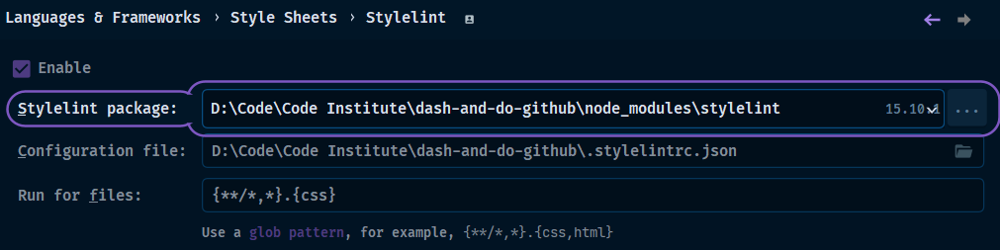
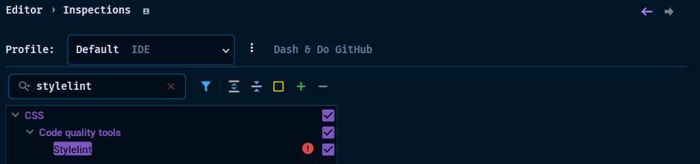

**META**: 23-07-12.18:29 | Last Edited By:


## Workflow | Issue

> .

- [ ] CONFIG:
    - [x]  Build | Integrate | Test | Quality |  Config | Deploy
- [ ] GitHub Issue(s) Created?
    - [x] FLOW: Workflow | Process | Outline
        - [x] #Issue #12 [FLOW :: Code Quality Assurance](https://github.com/iPoetDev/dash-and-do-github/issues/12)
        - [x] Doc : Ths 
        - [x] Commited to Github 
    - [ ] LINT: Report
        - [ ] #Issue
- [ ] FLOW
    - [x] Config .dotfile
        - [x] ` .stylelintrc.json`
    - [x] Local Script
        - [ ] Bash?
        - [x] AI Prompted Created
    - [x] IDE Configuration
        - [x] Actions on Save
        - [ ] Run Configuration?
    - [ ] Pre-Commit
        - [ ] 
    - [ ] CI Workflow
        - [ ] YML
        - [ ] Runner

# Package:

**`Intent | Purpose:`**

```ruby
>> help you **avoid errors**, invalid things, valid things that are problematic, unknown things
>> **enforce conventions**, disallow things, enforce naming patterns, set limits, specify notations
>>  Linters and pretty printers are complementary tools that work together to help you write consistent and error-free code.
```

[A linter and validator for CSS that is:](https://stylelint.io/about/vision)

- complete - coverage of all standard CSS syntax
- extensible - multiple points of extension
- configurable - options to tailor the linter
- robust - comprehensive test coverage
- consistent - conventions for behavior, naming and documentation
- performant - tools to test and improve performance

- Related Config
    - [[CONFIG - {{}}]]
    - [[prettier]] : recommend using a pretty printer like Prettier alongside Stylelint

## Package | Library Source

> .

- [ ] PIP
- [x] NPM
- [ ] Unpkg
- [ ] JsDeliver

**Link:** **`URL`**
```bash
https://stylelint.io/
```

### Source
- [ ] [**GITHUB**](https://github.com/stylelint/)
```bash
https://github.com/stylelint/
```

#### Dependencies
- NPM Search
    - [stylelint-config- - npm search (npmjs.com)](https://www.npmjs.com/search?q=stylelint-config-)
##### Shared Config
- [ ] [stylelint-config-standard](https://github.com/stylelint/stylelint-config-standard) - Standard config for CSS.
    - [ ] NPM: [stylelint-config-standard - npm (npmjs.com)](https://www.npmjs.com/package/stylelint-config-standard)
- [ ] Recommended shareable config for Stylelint
    - [ ] npm: [stylelint-config-recommended (npmjs.com)](https://www.npmjs.com/package/stylelint-config-recommended)
- [ ] [stylelint-config-rational-order](https://github.com/constverum/stylelint-config-rational-order) - Sorts related property declarations by grouping together in the rational order.
    - [ ] Stylelint config that sorts related property declarations by grouping together following the order: Positioning, Box Model, Typography, Visual, Animation, Other.
- [ ] [stylelint-config-primer](https://github.com/primer/stylelint-config-primer) - The GitHub shareable config.
- [ ] [stylelint-config-prettier](https://github.com/prettier/stylelint-config-prettier) - Turns off conflicting rules when using Prettier for CSS.
    - [ ] NPM: [stylelint-config-prettier (npmjs.com)](https://www.npmjs.com/package/stylelint-config-prettier)
- [ ] stylelint-config-tailwindcss
    - [ ] NPM: [stylelint-config-tailwindcss - npm (npmjs.com)](https://www.npmjs.com/package/stylelint-config-tailwindcss)
##### Plugins
- [stylelint-csstree-validator](https://github.com/csstree/stylelint-validator) - Validate CSS values to match W3C specs and browsers extensions.
##### Pre-commit
 - [ ] [pre-commit-stylelint](https://github.com/thibaudcolas/pre-commit-stylelint) - Mirrors all releases for the pre-commit hooks framework.
- .
  **Depends on:** ``

```bash
npm install --save-dev stylelint stylelint-config-standard-* (* <-add variant)
```

### Install

```bash
npm init stylelint
```

#### Run
```bash: {run}
npx stylelint "**/*.css"
```

### Config

```bash
    npm install --save-dev stylelint stylelint-config-standard postcss-lit
```

**`.stylelintrc.json`**
```json
{  
"extends": "stylelint-config-standard",  
"customSyntax": "postcss-lit", 
"rules": {
    // turn off
    "selector-class-pattern": null,
    // Lower serverity
    "property-no-vendor-prefix": [
      true,
      {
        "severity": "warning"
      }
    ],
    // add a rule
    "unit-allowed-list": ["em", "rem", "s"]
  }
}
```

**TAILWIND**: `stylelint-config-tailwindcss`
[github.com/zhilidali/stylelint-config-tailwindcss](https://github.com/zhilidali/stylelint-config-tailwindcss)
```json
{
  "extends": [
    "stylelint-config-recommended",
+   "stylelint-config-tailwindcss"
  ]
}
```

```javascript

```

```ini

```

#### IDE



#### Local | Pre-Commit Requirements | Proc
---
**Proc**: `Heroku`
```ini

```

**PYTHON**: **`Requirements.txt | Requirements-dev.txt | Requirements-test.txt`**
```text

```

**SCRIPT | RUN** `Script File`: - File Name: **``  .sh ``**  → See AI Prompt below
```bash
#!/bin/bash 
npx 
```

**CONFIGURATION | RUN** `Script File`

- Name:
- Allow Multiple: N | Y
- Store as File: N | Y
- Package.json: `D:\Code\Code Institute\dash-and-do-github\package.json`
- Command:
- Scripts:
- Arguments:
- Node: Node: `C:\Programs Files\node.js\node.exe` 20.3.0
- Node Options:
- Package manager: `C:\Program Files\node.js\node.exe`
- Environments:
- Before Launch:

```
Command: run
Script:
Arguement:
Node Opt: 
Environ:
```

**NPM**: `package.json`

```json
"devDependencies": {  
    "stylelint": "^15.10.1",  
    "stylelint-config-recommended": "^13.0.0",  
    "stylelint-config-standard": "^34.0.0",  
    "stylelint-config-tailwindcss": "^0.0.7",  
    "stylelint-csstree-validator": "^3.0.0",  
},
```

**Pre-Commit**: ``
**REV** [`https://github.com/thibaudcolas/pre-commit-stylelint/tags`](https://github.com/thibaudcolas/pre-commit-stylelint/tags)
```yml
repos:
- repo: https://github.com/thibaudcolas/pre-commit-stylelint
  rev: v15.10.0
  hooks:
    - id: stylelint
```

### Options

- Web: [Home | Stylelint](https://stylelint.io/)
- Community: [stylelint/awesome-stylelint: A list of awesome Stylelint plugins, configs, etc. (github.com)](https://github.com/stylelint/awesome-stylelint#readme)
- Docs: [Getting started | Stylelint](https://stylelint.io/user-guide/get-started)
- Package: [stylelint (npmjs.com)](https://www.npmjs.com/package/stylelint)
- GitHub: [Stylelint (github.com)](https://github.com/stylelint/)
- Perplexity:
    - https://www.perplexity.ai/search/d27d5cc1-70aa-447e-a6a5-41a800fde12b?s=c

## [AI Prompt](https://www.perplexity.ai/search/d27d5cc1-70aa-447e-a6a5-41a800fde12b?s=c)

- https://www.perplexity.ai/search/d27d5cc1-70aa-447e-a6a5-41a800fde12b?s=c
- Here is a bash script that uses Stylelint to check and fix a given file or directory:

- [ ] Uses config
- [ ] Create a report
- [ ] Use for a local pre-commit or IDE run config 

```bash
#!/bin/bash  

# Set the path to the Stylelint config file 
CONFIG_FILE=".stylelintrc.json"  
# Set the path to the output file 
OUTPUT_FILE="stylelint-report.md"  
# Set the formatter to use for the output 
FORMATTER="string"  
# Set the directory or file to check 
TARGET=$1  
# Check if the target is a directory or file 

if [ -d "$TARGET" ]; then   
# Target is a directory   
   stylelint "$TARGET/**/*.css" --config "$CONFIG_FILE" --fix --formatter "$FORMATTER" > "$OUTPUT_FILE" 

elif [ -f "$TARGET" ]; then   
# Target is a file   
   stylelint "$TARGET" --config "$CONFIG_FILE" --fix --formatter "$FORMATTER" > "$OUTPUT_FILE" 

else   
# Target is not a valid file or directory   
    echo "Error: Invalid file or directory specified"
        exit 1

fi
```

This script 
- takes one argument, which is the file or directory to check. 
- It first sets the path to
    - the Stylelint config file and 
    - the output file, and 
    - the formatter to use for the output. 
- It then checks if the target is a directory or file, and 
- Runs Stylelint with the appropriate options. 
- The `--fix` option is 
    - used to automatically fix any fixable errors, and 
- the `--formatter` option is 
    - used to format the output as a string. 
- The output is then redirected to the output file specified.
- To use this script, save it to a file (e.g. `stylelint-check.sh`), 
    - make it executable (`chmod +x stylelint-check.sh`), and 
- Run it with the target file or directory as the argument 
    - (`./stylelint-check.sh path/to/file/or/directory`). 
- You can also modify the options in the script to suit your needs.

## Final

> FLOW

- [x] exclude: # stylelint-config-prettier
    - [x] As of Stylelint v15 [all style-related rules have been deprecated](https://stylelint.io/migration-guide/to-15#deprecated-stylistic-rules). 
    - [x] If you are using v15 or higher and are not making use of these deprecated rules, [this plugin is no longer necessary](https://stylelint.io/migration-guide/to-15#:~:text=Additionally%2C%20you%20may%20no%20longer%20need%20to%20extend%20Prettier%27s%20Stylelint%20config).

```json
{  
    "extends": [  
            "stylelint-config-recommended"  
            "stylelint-config-standard",  
            "stylelint-config-tailwindcss",  
        ]  
}
```

- The following is documented, so not to take on trust,,and to verify. 
- Pre-set shareable configs are useful, but declarative AUDITS maybe excessive but a good start.

### Recommended

```json
	rules: {
		'annotation-no-unknown': true,
		'at-rule-no-unknown': true,
		'block-no-empty': true,
		'color-no-invalid-hex': true,
		'comment-no-empty': true,
		'custom-property-no-missing-var-function': true,
		'declaration-block-no-duplicate-custom-properties': true,
		'declaration-block-no-duplicate-properties': [
			true,
			{
				ignore: ['consecutive-duplicates-with-different-syntaxes'],
			},
		],
		'declaration-block-no-shorthand-property-overrides': true,
		// FONTs
		'font-family-no-duplicate-names': true,
		'font-family-no-missing-generic-family-keyword': true,
		// FUNCTIONS
		'function-calc-no-unspaced-operator': true,
		'function-linear-gradient-no-nonstandard-direction': true,
		'function-no-unknown': true,
		// KEYFRAME
		'keyframe-block-no-duplicate-selectors': true,
		'keyframe-declaration-no-important': true,
		// MEDIA QUERY
		'media-feature-name-no-unknown': true,
		'media-query-no-invalid': true,
		//GRID
		'named-grid-areas-no-invalid': true,
		// SPECI
		'no-descending-specificity': true,
		'no-duplicate-at-import-rules': true,
		'no-duplicate-selectors': true,
		'no-empty-source': true,
		'no-invalid-double-slash-comments': true,
		'no-invalid-position-at-import-rule': true,
		'no-irregular-whitespace': true,
		'property-no-unknown': true,
		'selector-anb-no-unmatchable': true,
		'selector-pseudo-class-no-unknown': true,
		'selector-pseudo-element-no-unknown': true,
		'selector-type-no-unknown': [
			true,
			{
				ignore: ['custom-elements'],
			},
		],
		'string-no-newline': true,
		'unit-no-unknown': true,
	},
```

### Standard
> Turns on 50% of rules

```json
	extends: 'stylelint-config-recommended',
	rules: {
		'alpha-value-notation': [
			'percentage',
			{
				exceptProperties: [
					'opacity',
					'fill-opacity',
					'flood-opacity',
					'stop-opacity',
					'stroke-opacity',
				],
			},
		],
		'at-rule-empty-line-before': [
			'always',
			{
				except: ['blockless-after-same-name-blockless', 'first-nested'],
				ignore: ['after-comment'],
			},
		],
		'at-rule-no-vendor-prefix': true,
		'color-function-notation': 'modern',
		'color-hex-length': 'short',
		'comment-empty-line-before': [
			'always',
			{
				except: ['first-nested'],
				ignore: ['stylelint-commands'],
			},
		],
		'comment-whitespace-inside': 'always',
		'custom-property-empty-line-before': [
			'always',
			{
				except: ['after-custom-property', 'first-nested'],
				ignore: ['after-comment', 'inside-single-line-block'],
			},
		],
		'custom-media-pattern': [
			'^([a-z][a-z0-9]*)(-[a-z0-9]+)*$',
			{
				message: (name) => `Expected custom media query name "${name}" to be kebab-case`,
			},
		],
		'custom-property-pattern': [
			'^([a-z][a-z0-9]*)(-[a-z0-9]+)*$',
			{
				message: (name) => `Expected custom property name "${name}" to be kebab-case`,
			},
		],
		'declaration-block-no-redundant-longhand-properties': true,
		'declaration-block-single-line-max-declarations': 1,
		'declaration-empty-line-before': [
			'always',
			{
				except: ['after-declaration', 'first-nested'],
				ignore: ['after-comment', 'inside-single-line-block'],
			},
		],
		'font-family-name-quotes': 'always-where-recommended',
		'function-name-case': 'lower',
		'function-url-quotes': 'always',
		'hue-degree-notation': 'angle',
		'import-notation': 'url',
		'keyframe-selector-notation': 'percentage-unless-within-keyword-only-block',
		'keyframes-name-pattern': [
			'^([a-z][a-z0-9]*)(-[a-z0-9]+)*$',
			{
				message: (name) => `Expected keyframe name "${name}" to be kebab-case`,
			},
		],
		'length-zero-no-unit': [
			true,
			{
				ignore: ['custom-properties'],
			},
		],
		'media-feature-name-no-vendor-prefix': true,
		'media-feature-range-notation': 'context',
		'number-max-precision': 4,
		'property-no-vendor-prefix': true,
		'rule-empty-line-before': [
			'always-multi-line',
			{
				except: ['first-nested'],
				ignore: ['after-comment'],
			},
		],
		'selector-attribute-quotes': 'always',
		'selector-class-pattern': [
			'^([a-z][a-z0-9]*)(-[a-z0-9]+)*$',
			{
				message: (selector) => `Expected class selector "${selector}" to be kebab-case`,
			},
		],
		'selector-id-pattern': [
			'^([a-z][a-z0-9]*)(-[a-z0-9]+)*$',
			{
				message: (selector) => `Expected id selector "${selector}" to be kebab-case`,
			},
		],
		'selector-no-vendor-prefix': true,
		'selector-not-notation': 'complex',
		'selector-pseudo-element-colon-notation': 'double',
		'selector-type-case': 'lower',
		'shorthand-property-no-redundant-values': true,
		'value-keyword-case': 'lower',
		'value-no-vendor-prefix': [
			true,
			{
				// `-webkit-box` is allowed as standard. See https://www.w3.org/TR/css-overflow-3/#webkit-line-clamp
				ignoreValues: ['box', 'inline-box'],
			},
		],
	},
```

### Prettier Rules

```json
	rules: {
		indentation: null,
		linebreaks: null,

		'at-rule-empty-line-before': null,
		'at-rule-name-case': null,
		'at-rule-name-newline-after': null,
		'at-rule-name-space-after': null,
		'at-rule-semicolon-newline-after': null,
		'at-rule-semicolon-space-before': null,
		'block-closing-brace-empty-line-before': null,
		'block-closing-brace-newline-after': null,
		'block-closing-brace-newline-before': null,
		'block-closing-brace-space-after': null,
		'block-closing-brace-space-before': null,
		'block-opening-brace-newline-after': null,
		'block-opening-brace-newline-before': null,
		'block-opening-brace-space-after': null,
		'block-opening-brace-space-before': null,
		'color-hex-case': null,
		'declaration-bang-space-after': null,
		'declaration-bang-space-before': null,
		'declaration-block-semicolon-newline-after': null,
		'declaration-block-semicolon-newline-before': null,
		'declaration-block-semicolon-space-after': null,
		'declaration-block-semicolon-space-before': null,
		'declaration-block-trailing-semicolon': null,
		'declaration-colon-newline-after': null,
		'declaration-colon-space-after': null,
		'declaration-colon-space-before': null,
		'function-comma-newline-after': null,
		'function-comma-newline-before': null,
		'function-comma-space-after': null,
		'function-comma-space-before': null,
		'function-max-empty-lines': null,
		'function-parentheses-newline-inside': null,
		'function-parentheses-space-inside': null,
		'max-empty-lines': null,
		'max-line-length': null,
		'media-feature-colon-space-after': null,
		'media-feature-colon-space-before': null,
		'media-feature-name-case': null,
		'media-feature-parentheses-space-inside': null,
		'media-query-list-comma-newline-after': null,
		'media-query-list-comma-newline-before': null,
		'media-query-list-comma-space-after': null,
		'media-query-list-comma-space-before': null,
		'no-empty-first-line': null,
		'no-eol-whitespace': null,
		'no-extra-semicolons': null,
		'no-missing-end-of-source-newline': null,
		'number-leading-zero': null,
		'number-no-trailing-zeros': null,
		'property-case': null,
		'selector-attribute-brackets-space-inside': null,
		'selector-attribute-operator-space-after': null,
		'selector-attribute-operator-space-before': null,
		'selector-attribute-quotes': null,
		'selector-combinator-space-after': null,
		'selector-combinator-space-before': null,
		'selector-descendant-combinator-no-non-space': null,
		'selector-list-comma-newline-after': null,
		'selector-list-comma-newline-before': null,
		'selector-list-comma-space-after': null,
		'selector-list-comma-space-before': null,
		'selector-max-empty-lines': null,
		'selector-pseudo-class-case': null,
		'selector-pseudo-class-parentheses-space-inside': null,
		'selector-pseudo-element-case': null,
		'string-quotes': null,
		'unicode-bom': null,
		'unit-case': null,
		'value-list-comma-newline-after': null,
		'value-list-comma-newline-before': null,
		'value-list-comma-space-after': null,
		'value-list-comma-space-before': null,
		'value-list-max-empty-lines': null,
```

### Tailwind Rules
```json
 rules: {
    'at-rule-no-unknown': [
      true,
      {
        ignoreAtRules: [
          'tailwind',
          'apply',
          'layer',
          'config',
          /** tailwindcss v1, v2 */
          'variants',
          'responsive',
          'screen',
        ],
      },
    ],
    'function-no-unknown': [
      true,
      {
        ignoreFunctions: ['theme'],
      },
    ],
  },
```

### Steps

1.  [x] Install by NPM
2. [x] Install Sharable Configs: Recommended, Standard and Tailwind
    1.  [ ] Other plugins: W3C Validator, rationale order, etc
    2. [ ] Do not install Shareable Config for Prettier at Stylelint v15 has disabled Style rules for prettier
3. [x] Code Actions on Save in IDE (Integrations) and Problem Inspections
4. [ ] Configure `.pre-commit-configuration.yaml`
    1. [ ] Run pre-commit like a local runner and not on pre-commit
    2. [ ] Then use pre-commit to test for all PASS on commit
5. [ ] Create and test bash for local script - a Final Report?
6. [ ] Setup IDE Run Configuration
7. [ ] CI Use the GitHub Super Linter
8. 
9. 

### Repository

```dirtree

- /dash-and-do-github
	- /.github
		- /workflows
			- .yml
	- /docs
		- /integration
			- /1-dev
				- file.md
	- /scripts
		- /1-dev
			- .sh
	- .file
```

## Sources

- .
- .
- .

---
> .
---