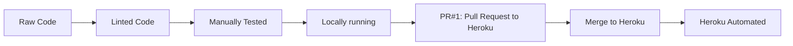
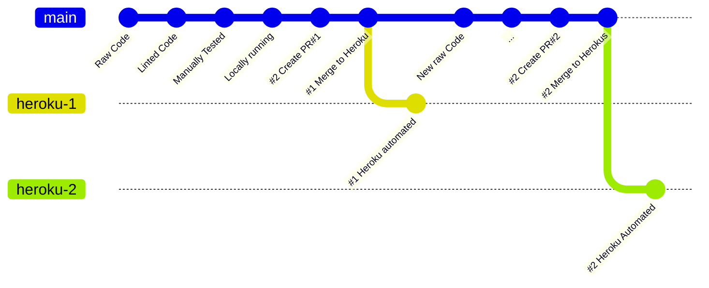

- [ ] Completed?
- [ ] Copy to Readme.md?

## 15. [Deploy](#deploy)

> SOLUTION: Host | Cloud | PaaS | Web App

- [x] Criteria: LO-06-PASS | LO-6.1-PASS ✅ 2023-07-06
- [ ] Completed? 🛫

### 15.1. [Deployment Flow](#deploy-flow)

> SOLUTION: Host | Cloud | PaaS | DB Service

- [x] Criteria: LO-06-PASS | LO-6.1-PASS ✅ 2023-07-06
- [ ] ADR: ADR000X: Choose a cloud hosting platform.
- [ ] Completed? 🛫 2023-07-06

#### 15.1.1. 1. [Heroku Create App](# heroku)

> SOLUTION: Host | Cloud | PaaS | Web App

- [x] Criteria: LO-06-PASS | LO-6.1-PASS ✅ 2023-07-06
- [ ] Completed? 🛫 2023-07-06

##### 15.1.1.1. Workflow

- 1: Login to Heroku, and verify and MFA authenticate
- 2: Create a new app.
  
- 3: Choose a deployment method. ``GitHub``
  
- 4: Connect to GitHub and search for the repository: ``PyCriteria``
  
- 5: Connect to chosen Repository and verify
  
  
- 6: **BUILDPACK**:
    - Add *BuildPacks* in correct order,
    - Order sensitive, for good first run
    - [ ] Use built-in *BuildPacks* for *Node.js* and *Python*
        - [ ] 1st: `heroku/nodejs`
        - [ ] 2nd: `heroku/python`
- 7: **ENVIRONMENTAL VARS**:
    - Heroku Config Vars
    - Add Secrets:
        - [ ] API Tokens
        - [ ] CSRF Token
        - [ ] DB Connection STRINGS
        - [ ] Other Secrets
- 8: **PULL REQUEST**:
    - On *GitHub*,
        - Deploy to **`Heroku-^`** release trunk branch..
        - Pull from **`main`** trunk branch..
        - Via a PullRequest.
          

---

#### 15.1.2. [App Information](#heroku-app) <small><sup>✅</sup></small>

> SOLUTION:

- [ ] Criteria:
- [ ] Completed?

        Name | Region | Stack | Framework | Slug Size | ConfigVars | Buildpacks | SSL Certs | Repo | Local Git

------------:|:-------|:----------|:----------|:-----------|:-----------|:--------------|:----------|:--------------------|:--------
{{appname}} | Europe | heroku-22 | Python | 30/500 MiB | In Use | heroku/python | None |
iPoetDev/{{appname}} |https://git.heroku.com/{{repo}}.git
{{dbname}} | Europe | --- | Python | 30/500 MiB | In Use | --- | None |
iPoetDev/{{appname}} |https://git.heroku.com/{{repo}}.git

---

#### 15.1.3. [Heroku Branch Deployment](#heroku-git)

> SOLUTION: Branch | Trunk | Build | Deploy

- [ ] Criteria:
- [ ] ADR:
- [ ] Completed?

##### 15.1.3.1. **A1: Heroku Release Flow**



##### 15.1.3.2. **A2: Heroku Commit Flow**



---

#### 15.1.4. 4. [Heroku Configuration](#heroku-config)

> SOLUTION: Dyno | Configuration | BuildPacks | Node | Python

- [ ] Criteria:
- [ ] ADR:
- [ ] Completed?

- Dyno:
  -
- ProcFile:
    - ``
- Must have *BuildPacks* installed in the correct order
    1. `heroku/nodejs`
    2. `heroku/python`

---

#### 15.1.5. [Heroku CLI Logs](#eroku-logs)

> SOLUTION:

- [ ] Criteria:
- [ ] ADR:
- [ ] Completed?

- CLI Documentation: [Heroku CLI](https://devcenter.heroku.com/articles/heroku-cli)

```bash
heroku logs --app={{repo}} --tail
```

- [ ] CHECK: [ ] repo

- Other useful runners

```bash
heroku option --app={{repo}} arguement
```

- [ ] CHECK: [ ] repo

---

#### 15.1.6. [Repository Service](#repo-vcs)

> SOLUTION:

- [ ] Criteria:
- [ ] ADR:
- [ ] Completed?

- [GitHub.com](https://www.github.com) is the chosen remote code repository service being used.

      User | Profile | Repo | Link | Visibility | Issues  | Project | Milestone | Wiki |

----------:| :--- | :--- |:---------------------------------------|:--- |:--- |:--- |:--- |:---
@iPoetDev | @iPoetDev | {{repo}} | https://github.com/iPoetDev/{{repo}} | Public | Issues

- [ ] CHECK: [ ] Repo [ ] Link, [ ] Issues Link [ ] Project Link

---

#### 15.1.7. [Local Git Service / IDE](#local-git)

> SOLUTION:

- [ ] Criteria:
- [ ] ADR:
- [ ] Completed?

- PyCharm | WebStorm configured with GitHub account for Local development environment.
- Utilized a modified/reduced Changelog format to document the changes, a-la, Keep a Changelog.
- Instead of using changelog.md, I used PyCharm's peristence of commit messages as a changelog/planning tool,
  intentionally.
- Directly in the commit messages.
- Reduced efforts by not maintaining the ``changelog.md``, which is abandoned.
- Mostly adhered to Semantic Versioning approach.
- Minor adjustment was to put a double-digit index for each separate commit if several occurred on one day.

---

#### 15.1.8. [Deployment Environment](#deploy-env)

> SOLUTION:

- [ ] Criteria:
- [ ] ADR:
- [ ] Completed?

- Heroku is the cloud environment for deployment.
    - Deploy a static web page off every commit.
    - Once the commit is built, then deploys the new website and pushes to hosted domain URI.
- Heroku is the hosted domain URI and service.

##### 15.1.8.1. [App Web URI](#app-url)

> SOLUTION:

- [ ] Criteria:
- [ ] ADR:
- [ ] Completed?

- **Plain Text**: ``` https://{{appname}}.herokuapp.com/ ```
- **Link
  **: [https://{{appname}}.herokuapp.com/](https://{{appname}}.herokuapp.com/ '{{appname}}: https://{{}}/herokuapp.com/')
- **APP Name**: Git Dash & Act

---
> .
---
