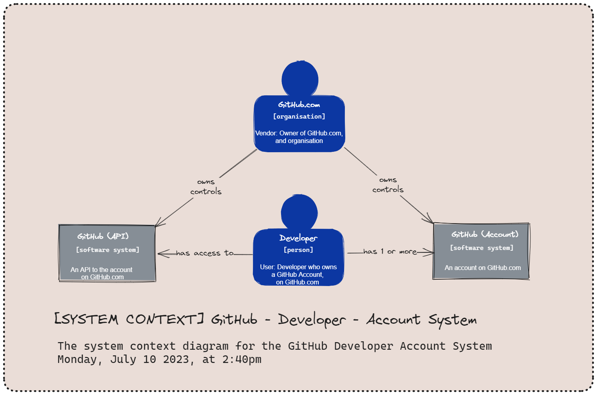
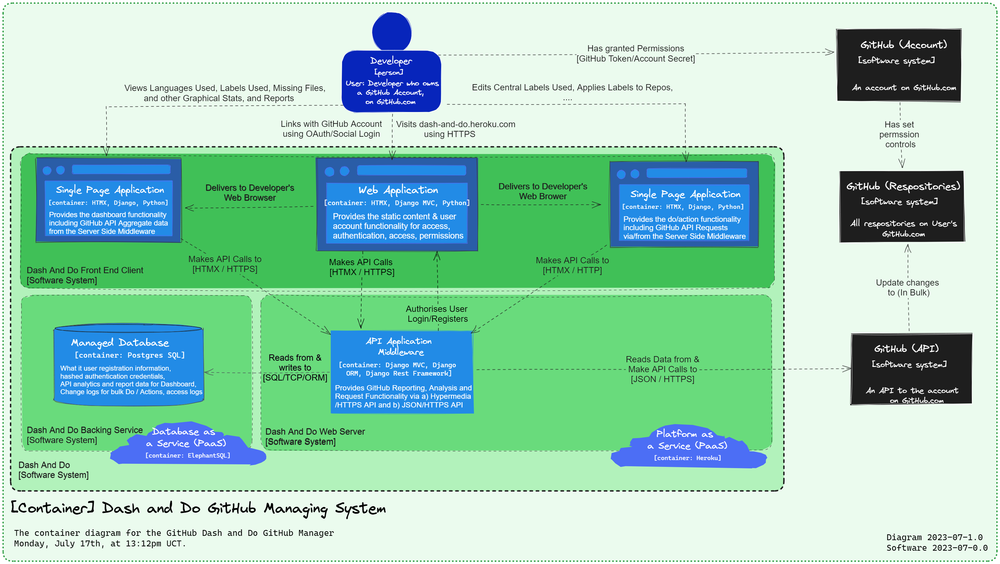

-   [ ] Completed?

## 7. [Architecture](#)

> SOLTUTION: #DESIGN | Strategy | Diagrams | Patterns | Technologies | Infrastructure | Components

-   [ ] Criteria:
-   [ ] Completed? 🛫

-   .
-   .

---

>

---

## 7.1 Method | Approach (C4 Model)

> SOLUTION: Design | Architecture | Abstraction-First | C4 Model

-   [ ] Criteria:
-   [ ] ADR:
-   [ ] Completed?

### Why:

-   C4 Model: [The C4 model for visualising software architecture]

```embed
title: "The C4 model for visualising software architecture"
image: "https://static.structurizr.com/workspace/36141/diagrams/SystemContext.png"
description: "                                 1. A set of hierarchical abstractions (software systems, containers, components, and code).                                 2. A set of hierarchical diagrams (system context, containers, components, and code).                                 3. Notation independent.                                 4. Tooling independent.                             "
url: "https://c4model.com/"
```

-   **Benefits**:
    -   Is a map to the code
    -   Notion & Tooling independent
    -   Aids with communication
    -   Abstraction first, constrained to 4 tiers of detail and number of diagram types.
-   **Architecture Design Flow**:
    -   [x] [Level 1: System Context Diagram](https://c4model.com/#SystemContextDiagram) - on C4Model.com
    -   [x] [Level 2: Container Diagram](https://c4model.com/#ContainerDiagram) - on C4Model.com
    -   [x] [Level 3: Component Diagram](https://c4model.com/#ComponentDiagram) - on C4Model.com
    -   ~~[Level 4: Code Diagram (`Optional`)](https://c4model.com/#CodeDiagram) - on C4Model.com [?]~~
-   [ ] Workflow:
-   [x] Design on Excalidraw in Obsidian under `Diagrams`
-   [x] Export / Copy to Readme (move images later)
-   [x] ## Add to Section below
                                  - [x] System Design
-   -   [x] Container Design
-   -   [ ] Component Design

> > > **`Optional`**: For this project, this level of detail is an optional nice to have if sufficient scope or time
> > > constraint before delivery.

---

## 7. 2 System Design (C4 Model)

> SOLUTION: Big Picture | System Landscape | People Focus | Software Systems | System Scope | External Systems

-   [x] Completed
-   [ ] .

-   [Level 1: System Context Diagram](https://c4model.com/#SystemContextDiagram) - on C4Model.com

### 7.2.1 GitHub - Developer - Account System

> SOLUTION: External System

-   [x] Completed
-   [ ] .

-   **`EXTERNAL SYSTEMS: A GitHub Real World Domain`**
-   **System**: GitHub.com as a remote distributed code versioning system.
-   **Users**: Developers, GitHub.com
-   **Roles**: People, Organizations
-   **External Dependencies**: GitHub User Account & Services, GitHub API
-   **Data Source**: GitHub API
-   **Scope**: Sits outside of the intended own software system
-   **Diagram Audience**: Users, Assessors, Developers etc


`Diagram: EXTERNAL SYSTEMS: GitHub Real World Domain & Datasource`

---

### 7.2.2 Dash and Do GitHub Managing System

> SOLUTION: Container (& Software Systems / Sub Containers) to External Containers

-   [x] Completed
-   [ ] .

_`Model Type: C4 System Context`_

\*\*`Diagram: SYSTEMS Context: Dash and Do GitHub Managing System

###### <ins>Overview</ins>

**1. Web Client**: GitHub <ins>Account</ins> - Developer - Own Web App & 2 Single Page Applications. [Sub System], e.g.
Django
**2. Web Server & API Client**: GitHub <ins>API</ins> - Developer - Own Web App (Django Web Server). [Sub System], e.g.
Django & Django Rest Framework
**3. Remote Backing Service**: Cloud Hosting Database-as-a-Service (App). [Sub System] e.g. Postgres SQL remote
relational database provider.
**4. Cloud Hosting**: Cloud Platform-as-a-Service (App) - Entire Dash & Do Software System [Container] e.g. Heroku
application service provider,
**5. GitHub External Systems**: e.g. GitHub Account, Repositories, API
**6. User/Person**: i.e. Developer

---

#### 7.2.2.1 The Web Client: GitHub <ins>Account</ins> - Developer - Own Web App [Dash & Do GH Manager]

> SOLUTION: CONTAINER: Software Sub-Container

-   [ ] Completed
-   [ ] .

-   **`EXTERNAL SYSTEMS: A GitHub Real World Domain`**
-   **System**: <ins>Web App Account Integration</ins>
-   **Users**: Developers
-   **Roles**: People
-   \*\*External Dependencies: GitHub User Account & Services,
-   **Data Source**: GitHub API, GitHub Account Auth. Tokens
-   **Scope**: Sits outside of the intended own software system, but is an Application Interface with own Web App.
-   **Features | Component**:
-   **Diagram Audience**: Users


\*\*`Diagram: EXTERNAL-INTERNAL SYSTEMS: GitHub Account API to Own Web Account User Account

---

#### 7.2.2.2 The Web Server & API Client: GitHub <ins>API</ins> - Developer - Own Web App [Dash & Do GH Manager]

> SOLUTION: External System

-   [ ] Completed
-   [ ] .

-   **`EXTERNAL SYSTEMS: A GitHub Real World Domain`**
-   **System**: <ins>Web App Features Integration & Data Source</ins>
-   **Users**: Developers
-   **Roles**: People
-   **External Dependencies**: GitHub API
-   **Data Source**: GitHub API, GitHub Account Auth. Tokens
-   **Scope**: Sits outside of the intended own software system, but is an Application Interface with own Web App
-   **App Features | Component**:
-   **Diagram Audience**: Users


\*\*`Diagram: EXTERNAL-INTERNAL SYSTEMS: GitHub Account API to Own Web Account User Account

#### 7.2.2.3 The Backing Service: Own Web App [Dash & Do GH Manager] - Cloud Hosting Database-as-a-Service (App)

> Managed Database Backing System
> SOLUTION: External System

-   [ ] Completed
-   [ ] .

-   **`EXTERNAL SYSTEMS: Fully Managed Relational Database System, Cloud Hosted`**
-   **System**: Cloud Hosting Managed Backing System
-   **Users**: App Developers, Managed RBS Service Owner
-   **Roles**: App Developer, RDB Account Owner, RBS Service Owner
-   **External Dependencies**: External Managed Relational Database (Service, Host)
-   **Data Source**: External Managed Relational Database (Service, Host)
-   **Scope**: Sits outside the intended own software system, but is an Application Interface with own Web App
-   **Features | Component**:
-   **Diagram Audience**: Users


**`Diagram: EXTERNAL-INTERNAL SYSTEMS: Own Web App [Dash & Do GH Manager] - Cloud Hosting Database-as-a-Service (App)**

---

#### 7.2.2.4 The Cloud Hosting Platform: Own Web App [Dash & Do GH Manager] - Cloud Hosting Platform-as-a-Service (App)

> SOLUTION: External System

-   [ ] Completed
-   [ ] .

-   **`EXTERNAL SYSTEMS: Cloud Hosting Platform-as-a-Service (App)`**
-   **System**: Cloud Hosting Managed Backing System
-   **Users**: App Developers, Managed RBS Service Owner
-   **Roles**: App Developer, RDB Account Owner, RBS Service Owner
-   **External Dependencies**: External Managed Relational Database (Service, Host)
-   **Data Source**: External Managed Relational Database (Service, Host)
-   **Scope**: Sits outside of the intended own software system, but is an Application Interface with own Web App
-   **App Features | Component**:
-   **Diagram Audience**: Users


**`Diagram: EXTERNAL-INTERNAL SYSTEMS: Own Web App [Dash & Do GH Manager] - Managed Database Backing System**

---

>

---

## 7.3 Container Design (C4 Model)

> SOLUTION: Application | Data Store | Sub System | Contained Design

-   [x] Completed
-   [ ] Reviewed?

-   [Level 2: Container Diagram](https://c4model.com/#ContainerDiagram) - on C4Model.com
-   `A container is essentially a context or boundary inside which some code is executed or some data is stored.`
-   Each container 's:
    -   a separately deployable/runnable thing or runtime environment.
    -   typically (but not always) running in its own process space.
    -   communication between containers typically takes the form of an inter-process communication (e.g. API, RPC etc).

#### 7.3.0.1 Definitions

-   **Server-side web application**:
    -   e.g. A Java EE web application running on Apache Tomcat, an ASP.NET MVC application running on Microsoft IIS, a
        Ruby on Rails application running on WEBrick, a Node.js application, etc.
-   **Client-side web application**:
    -   e.g. A JavaScript application running in a web browser using Angular, Backbone.JS, jQuery, etc.
-   **Serverless function**:
    -   A single serverless function (e.g. Amazon Lambda, Azure Function, etc).
-   **Database**:
    -   e.g. A schema or database in a relational database management system, document store, graph database, etc such as
        MySQL, Microsoft SQL Server, Oracle Database, MongoDB, Riak, Cassandra, Neo4j, etc.

_`Model Type: C4 Container`_

**`Diagram: CONTAINER - EXTNERAL CONTAINERS: The Dash & Do GitHub Managing System`**

**1. Front End Web Application/Client**: Web Application User Account & Profile[Sub System]
**1.1 Web SPA**: Web Application **Dash(board) Single Page Application** [Sub System]
**1.2. Web SPA**: Web Application **Do (& Act) Single Page Application** [Sub System]
**2. Web Server & API Application Middleware**: GitHub <ins>API</ins> - Developer - Own Web App (Django Web
Server). [Sub System]
**3. Database as a Service’s Managed Database**: Cloud Hosting Database-as-a-Service (App). [Sub System]
**4. Cloud Hosting Platform-as-a-Service (App)**: Entire Dash & Do Software System [Container]

---

### 7.3.1 Web Application User Account & Profile

-   [ ] Completed
-   [ ] .

-   **`CONTAINERS | SUB SYSTEMS: An Internal Web Application Domain`**
-   **Containers**:
    -   **Server-side web application**:
    -   **Client-side web application**:
    -   **Database**:
    -   **Interface API**:
-   **Architecture**: <ins>Web App Client - Server Architecture</ins>:
-   **Part of**: _7.2.1 GitHub - Developer - Account System_
-   **Actor**: Developer, GitHub API
-   **External Dependencies**: Hub API, GitHub Access Token
-   **Data Source**: GitHub API, GitHub Account Auth. Tokens
-   **Scope**: Sits outside intended own software system, but is an Application Interface with own Web App.
-   **App Features | Component**:
-   **Diagram Audience**: Users


**`Diagram: EXTERNAL-INTERNAL SYSTEMS: Web Application User Account & Profile**

---

#### 7.3.1.1 Web Application Dash(board) Single Page Application

-   [ ] Completed
-   [ ] .

-   **`CONTAINERS | SUB SYSTEMS: An Internal Web Application Domain`**
-   **Containers**:
    -   **Server-side web application**:
    -   **Client-side web application**:
    -   Middleware Web Framework: Django
    -   **Database**:
        -   ORM: Django ORM
    -   **Interface API**:
-   **Architecture**: <ins>Web App Client - Hypermedia API - Server Architecture</ins>:
-   **Part of**: _7.2.1 GitHub - Developer - Account System_
-   **Actor**: Developer, GitHub API
-   **External Dependencies**s: GitHub API, GitHub Access Token.
-   **Data Source**: GitHub API, GitHub Account Auth. Tokens
-   **Scope**: Sits outside the intended own software system, but is an Application Interface with own Web App.
-   **App Features | Component**:
-   **Diagram Audience**: Users


**`Diagram: INTERNAL SYSTEMS: Web Application Dash(board) Single Page Application**

---

#### 7.3.1.2 Web Application Do(Repo tasks) Single Page Application

-   [ ] Completed
-   [ ] .

-   **`CONTAINERS | SUB SYSTEMS: An Internal Web Application Domain`**
-   **Containers**:
    -   **Server-side web application**:
    -   **Client-side web application**:
    -   Middleware Web Framework: Django
    -   **Database**: Postgres SQL
        -   ORM: Django ORM
    -   **Interface API**:
-   **Architecture**: <ins>Web App Client - Hypermedia API - Server Architecture</ins>:
    -   Style: Hypermedia Drive API
-   **Part of**: _7.2.1 GitHub - Developer - Account System_
-   **Actor**: Developer, GitHub API
-   **External Dependencies**: GitHub API, GitHub Access Token.
-   **Data Source**: GitHub API, GitHub Account Auth. Tokens
-   **Scope**: Sits outside the intended own software system, but is an Application Interface with own Web App.
-   **Features | Component**:
-   **Diagram Audience**: Users


**`Diagram: INTERNAL SYSTEMS: Web Application Do(Repo tasks) Single Page Application**

---

### 7.3.3 Web Server & API Application Middleware/Client

-   [ ] Completed
-   [ ] .

-   **`CONTAINERS | SUB SYSTEMS: An Internal Web Application Domain`**
-   **Containers**:
    -   **Server-side web application**:
    -   **Client-side web application**:
    -   Middleware Web Framework: Django
    -   **Database**: Postgres SQL
        -   ORM: Django ORM
    -   **Interface API**:
-   **Architecture**: <ins>Web App Client - Hypermedia API - Server Architecture</ins>:
    -   Style: Hypermedia Drive API
-   **Part of**: _7.2.1 GitHub - Developer - Account System_
-   **Actor**: Developer, GitHub API
-   **External Dependencies**s: GitHub API, GitHub Access Token.
-   **Data Source**: GitHub API, GitHub Account Auth. Tokens
-   **Scope**: Sits outside of the intended own software system, but is an Application Interface with own Web App.
-   **App Features | Component**:
-   **Diagram Audience**: Users


**`Diagram: INTERNAL SYSTEMS: Web Application Do(Repo tasks) Single Page Application**

---

### 7.3.4 Managed Relational Database

-   [ ] Completed
-   [ ] .

-   **`CONTAINERS | SUB SYSTEMS: An Internal Web Application Domain`**
-   **Containers**:
    -   **Server-side web application**:
    -   **Client-side web application**:
    -   Middleware Web Framework: Django
    -   **Database**: Postgres SQL
        -   ORM: Django ORM
    -   **Interface API**:
-   **Architecture**: <ins>Web App Client - Hypermedia API - Server Architecture</ins>:
    -   Style: Hypermedia Drive API
-   **Part of**: _7.2.1 GitHub - Developer - Account System_
-   **Actor**: Developer, GitHub API.
-   **External Dependencies**s: GitHub API, GitHub Access Token.
-   **Data Source**: GitHub API, GitHub Account Auth. Tokens
-   **Scope**: Sits outside of the intended own software system, but is an Application Interface with own Web App.
-   **App Features | Component**:
-   **Diagram Audience**: Users


**`Diagram: INTERNAL SYSTEMS: Web Application Do(Repo tasks) Single Page Application**

---

### 7.3.5 Platform as Host - Application Services

-   [ ] Completed
-   [ ] .

-   **`CONTAINERS | SUB SYSTEMS: An Internal Web Application Domain`**
-   **Containers**:
    -   **Server-side web application**:
    -   **Client-side web application**:
    -   Middleware Web Framework: Django
    -   **Database**: Postgres SQL
        -   ORM: Django ORM
    -   **Interface API**:
-   **Architecture**: <ins>Web App Client - Hypermedia API - Server Architecture</ins>:
    -   Style: Hypermedia Drive API
-   **Part of**: _7.2.1 GitHub - Developer - Account System_
-   **Actor**: Developer, GitHub API
-   \*\*External Dependencies: GitHub API, GitHub Access Token
-   **Data Source**: GitHub API, GitHub Account Auth. Tokens
-   **Scope**: Sits outside of the intended own software system, but is an Application Interface with own Web App
-   **Features | Component**:
-   **Diagram Audience**: Users


**`Diagram: INTERNAL SYSTEMS: Web Application Do(Repo tasks) Single Page Application**

---

>

---

## 7.4 Component Design (C4 Model)

> SOLUTION | Exclude Django Framework Components | Include Custom Components

-   [ ] Completed
-   [ ] .

-   [Level 3: Component Diagram](https://c4model.com/#ComponentDiagram) - on C4Model.com

##### 7.4.0.1 Definition

-   a component is a grouping of related functionality encapsulated behind a well-defined interface.
-   a component as a collection of implementation classes behind an interface.
-   all components inside a container typically execute in the same process space.
-   **components are not separately deployable units,** and are highly dependent.

---

### 7.4.1

> SOLUTION:

-   [ ] Completed
-   [ ] .

**Scope**: Target Container:
**Primary elements**: Components within the `container` in scope.

-   .
-   .
    **Supporting elements**:
-   Containers (within the software system in scope) plus
-   People directly connected to the components.
-   software systems directly connected to the components.
    **Diagram Audience**: Software architects and developers.

---

>

---

## 7.5 Code Diagram 🚫 (C4 Model)

> SOLUTION: Not Recommend | System Design to Simple | Level of Detail No Required.

-   [ ] Completed
-   [ ] .

-   For this project this is not necessary,
-   Too high maintenance and effort to create, update and manage
-   Services like [AppMap | Runtime Code Analysis for Developers AppMap https://appmap.io](https://appmap.io/) and IDEs
    can generate this level of detail on demand, for long-lived documentation,
-   Available on demand, automatically generated by keep detail to a minimum as details of implementation are subject to
    frequently change.

**Read more**

-         -   [Level 4: Code Diagram (`Optional`)](https://c4model.com/#CodeDiagram) - on C4Model.com [?]

---

>

---

## 7.6 User Journey

> SOLUTION:

-   [ ] Completed
-   [ ] .

-   .

---

>

---

## 7.7 State & Activity Diagrams

> SOLUTION:

-   [ ] Completed
-   [ ] .

-   .

---

>

---
